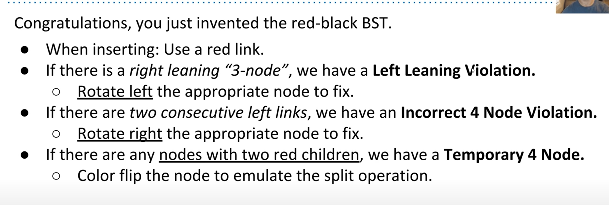

# B Tree 和左倾红黑树 LLRB 

> left-leaning red black tree : 是介于 B tree 和 BST (二分查找树) 之间的一种树

二分查找树的平衡是基于随机性的，在一般情况下是大致平衡的，但是也有例外
B tree 平衡树在建立时就是平衡的，然而实现起来特别复杂，也有点slow（应该是应为实现复杂所以才慢，结构还是非常完美的）
红黑树借鉴了Ｂtree的思想, 实现非常简单，速度也快，下面是对红黑树的理解（一律使用左倾红黑树，java库的红黑树过于复杂，虽然快了一点点）

### Tree Rotation

RotationLeft (X): X要向左旋转，1.  则X要与右子节点结合到一起， 2. 结合以后再分离，且原来的右子节点向上成为新的父节点，X则变为其左节点，原来的右节点的左节点变成了X的节点

精简步骤：向右方向旋转：

1. 当前节点与左节点结合
2. 再裂开：左节点成为父节点，当前节点成为其右子节点

> 理解旋转：将X向右旋转就是将X节点以及X的链接（与相应的子节点）的链接，向右进行旋转，并且在过程中完成节点直接链接的合并

### B树

> B 树是自底向下的 ，从叶子向根堆积的，在这个过程中，B树会保持稠密与平衡

常见的B树有 2-3 树和23-4树，2-3树意思是当有两个节点再加一个节点的时候，中间那个节点就会向上分裂，两边的节点会再其两边。23-4树就是有3个节点再来一个节点的时候，中间靠左边的那个节点就会向上分裂，其余自行排列。

B树也可以认为是树加数组，只不过树是有序的，数组也是有序的，查找速度会稍微受到数组的长度的影响，但因为数组长度限制在3或者4，因而也是常量级别的

B树的构成具有两个不变量，常用来进行更详细的分析

1. 左右两边所有叶子到根的距离必须是相等的（叶子就是任何没有子节点的节点）
2. 一个节点如果有n个元素，那么这个节点下面一定会有n+1个子节点（因为只有当子节点满了以后才会溢出父节点）

### 红黑树

##### 红黑树与B树的映射关系

**（ps: 此后的B树专门指的是23树）**

B树的一个粘合节点/数组，也就是两个黏在一起的节点，按照右节点为父节点，左节点为左子节点的关系经行映射，它们之间的链接用红色表示，正常的用黑色表示。根据这一关系，可以将每个B树与红黑树互相映射。

红黑树的不变量：

1. 根节点到任何一个叶子的黑色链接数必然相等
2. 任何一个节点最多只能有一个红色左链接

根据B树的特点，对于不同情况的插入，产生的不同结果，映射到红黑树，就有以下的规律

1. 只要是插入，不管是左插入还是右插入，一律使用红色链接（后面会调整的）
2. 如果节点有一个右链接，就对这个节点进行左旋转
3. 如果父节点与子节点和子子节点都是左红链接，就对父节点经行右旋转
4. 如果一个节点有左链接和右链接，那么将这个节点的所有链接都反转颜色（两个子节点变成黑色链接，父节点变成红色链接），形状不变

对上述4步经行连续操作就能得到一个符合不变量的红黑树了。

> 根据上面的步骤，只需要在BST的基础上加三行代码就能变成左倾红黑树了。

#### 树的缺陷

尽管大多数树查找插入都是 theta (n)级别的，但是它需要元素之间能够可比，而接下来的数据结构叫做Hash 哈希，它的查找与插入能达到 theta (1) 常量级别，同时不需要元素可比，Let's go!

