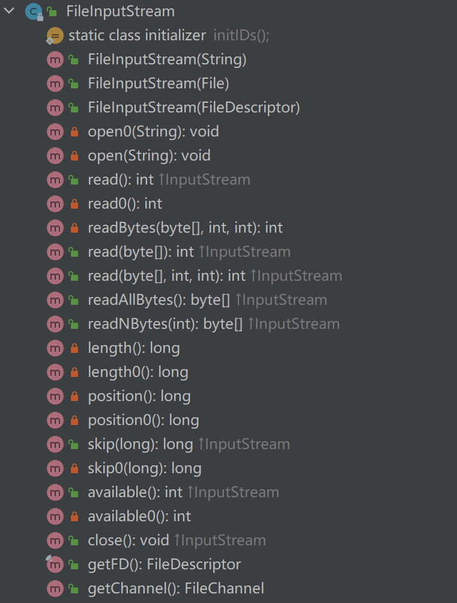

## IO流

按照方向，流分为输入流和输出流，按照读取方式，流分为字节流和字符流

| 流类型 | 简介                                                         |
| ------ | ------------------------------------------------------------ |
| 输入流 | 从磁盘上的文件加载到内存中，<br />注意内存是断电即失的       |
| 输出流 | 写入到磁盘上的文件                                           |
| 字节流 | 每次读取一个字节，<br />英文字符在windows操作系统上是一个字节，<br />根据老杜的说法，一个中文是两个字节，<br />但是编程需要三个字节，<br />可以读取任意数据 |
| 字符流 | 每次读取一个字符，中英文都可以，<br />仅限于读取文本文档，word文件是二进制文件读不了 |

下面是java对应的IO流基类

| 流类型     | java类(包为java.io.) |
| ---------- | -------------------- |
| 字节输入流 | InputStream          |
| 字节输出流 | OutputStream         |
| 字符输入流 | Reader               |
| 字符输出流 | Writer               |

> 对于4个类是java io文件中的基类，都是抽象类，它们都继承了Closeable接口，所以一定要close()关闭

> 输出流都继承了Flushable接口，都可以进行flush()操作，flush将管道中的流全部输出，防止有部分数据未输出而丢失，常常在最后的使用使用

#### FileInputStream 类

下面是该类的主要方法，绿色的锁表示public 方法，我们主要关心这些方法。



可以在IDEA中使用ctrl点击类进入到类体中，然后按alt+7键就可以浏览到类中的方法了。点击这些方法就可以进行跳转。

| 方法名                           | 概述                                                         |
| -------------------------------- | ------------------------------------------------------------ |
| FileInputStream(String filePath) | 通过文件的路径来构造对象                                     |
| read()                           | 读取字节，返回字节的int表示                                  |
| read(byte[] b)                   | 将字节依次写入到数组中，返回写入的个数，<br />如果未读到，返回-1 |
| close()                          | 使用以后 必须关闭                                            |
| available()                      | 返回还有多少个字节没有被读到 <br />刚开始使用能获取到文件的总字节数 |
| skip(int n)                      | 跳过前n个字节不进行读取                                      |

> IDEA中的当前路径默认是项目project的根目录

##### 使用FileInputStream 的read()来读取文件示例

```java
package com.weinijuan.test00;
// import 
import java.io.File;
import java.io.FileInputStream;
import java.io.FileNotFoundException;
import java.io.IOException;
public class FileInputStreamTest
{
    public static void main(String[] args)
    {
        FileInputStream fileInputStream = null;
        try
        {
             fileInputStream = new FileInputStream("src/com/weinijuan/test00/test.txt");
             while ((a = fileInputStream.read()) != -1)
             {
                 System.out.println(a);
             }
        } catch (FileNotFoundException e)
        {
            e.printStackTrace();
        } catch (IOException e)
        {
            e.printStackTrace();
        } finally
        {
            if (fileInputStream != null)
            {
                try
                {
                    fileInputStream.close();
                } catch (IOException e)
                {
                    e.printStackTrace();
                }
            }
        }
    }
}

```

> 对于导包， 异常，都交给idea来迅速处理

> 这种方法的缺点是每读一个字节，内存都要和硬盘交互一次，效率太低

##### 使用FileInputStream的read(byte[] b)方法来读取文件（读取英文几乎是最优解）

```java
package com.weinijuan.test00;
import java.io.FileInputStream;
import java.io.FileNotFoundException;
import java.io.IOException;

public class FileInputStreamTest2
{
    public static void main(String[] args)
    {
        FileInputStream fileInputStream = null;
        byte[] ar = new byte[4]; // 应该设得再大点
        {
            try
            {
                fileInputStream = new 			     FileInputStream("src/com/weinijuan/test00/test2.txt");
                int readCount;
                while ((readCount = fileInputStream.read(ar)) != -1)
                {
                    System.out.print(new String(ar, 0, readCount));
                    // 调用String 的构造函数能将byte[]数组转换为String
                    // 第二个参数表示起始位置，也叫offset偏移量
                    // 第三个参数是要转换的byte的个数
                }
            } catch (FileNotFoundException e)
            {
                e.printStackTrace();
            } catch (IOException e)
            {
                e.printStackTrace();
            } finally
            {
                try
                {
                    if (fileInputStream != null)
                    {
                        fileInputStream.close();
                    }
                } catch (IOException e)
                {
                    e.printStackTrace();
                }
            }
        }
    }
}

```

> 这种方法方便，但是因为中文是三个字节的，四个字节的数组一次一次读取可能读不到一个完整的中文，可以调整数组的大小使之变大从而降低概率。当然最好的办法是数组大小正好是文件的byte总数大小，因而可以使用available方法

#### 使用available进行优化中文读取

```java
package com.weinijuan.test00;
import java.io.FileInputStream;
import java.io.FileNotFoundException;
import java.io.IOException;

public class FileInputStreamTest2
{
    public static void main(String[] args)
    {
        FileInputStream fileInputStream = null;
        {
            try
            {
                fileInputStream = new 			     FileInputStream("src/com/weinijuan/test00/test2.txt");
                int readCount;
                int size = fileInputStream.available();
                byte[] ar = new byte[size];
                readCount = fileInputStream.read(ar);
                System.out.print(new String(ar));
            } catch (FileNotFoundException e)
            {
                e.printStackTrace();
            } catch (IOException e)
            {
                e.printStackTrace();
            } finally
            {
                try
                {
                    if (fileInputStream != null)
                    {
                        fileInputStream.close();
                    }
                } catch (IOException e)
                {
                    e.printStackTrace();
                }
            }
        }
    }
}
```

> 这种方法的缺点是，当文件太大的时候，相应的数组便会很大，非常不利于读取大文件。可以使用一个较为折中的方案，就是程序员预先判断size是否大于10000，如果小于就用上面的方法，大于就用大小为1000的数组多次读取，这里的10000与1000可以根据需要自行修改

