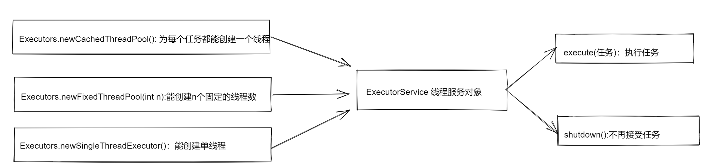
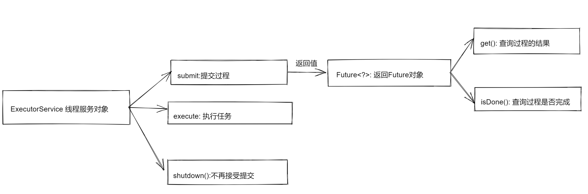
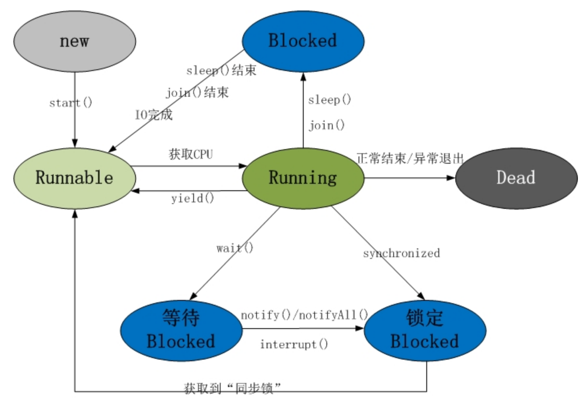
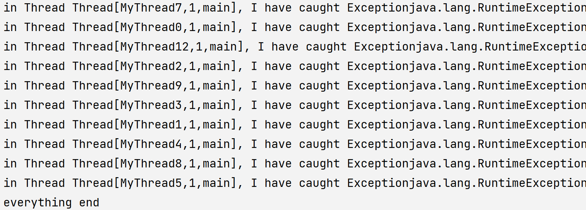
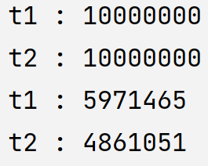
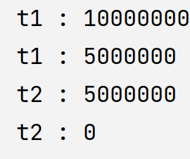
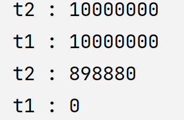
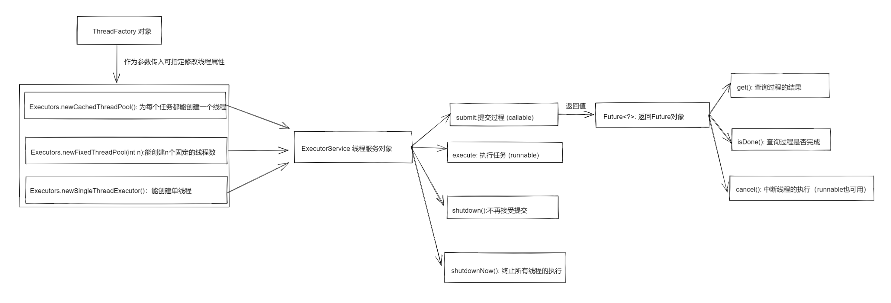
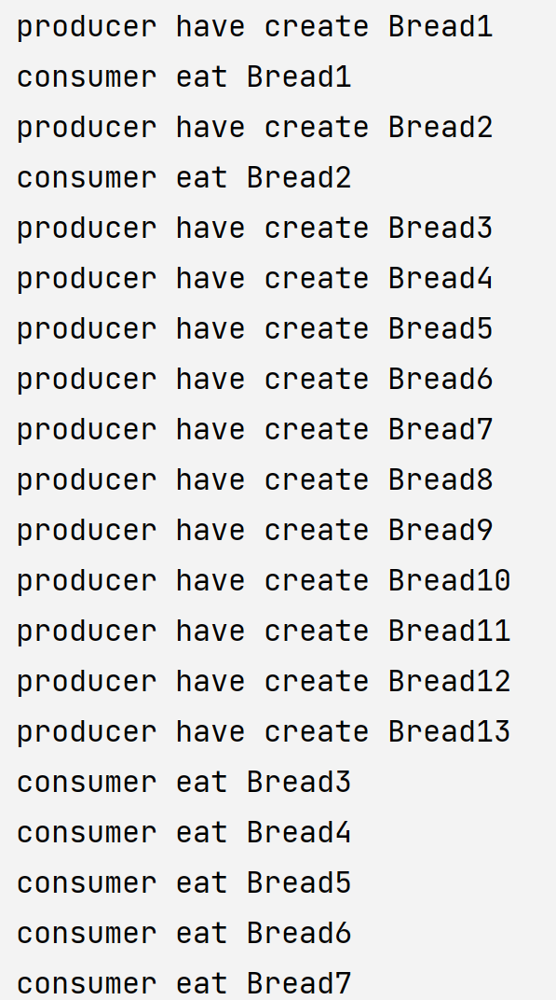

# 线程与并发

[toc]


java.util.concurrent并发包

##### 线程是什么？

极其简单的介绍线程机制：

单线程情况下，始终是一行代码一行代码的顺序向下执行，一个方法执行完了就执行下一个方法

如果是两个线程t1, t2，分别执行f1, f2方法，（我们称f1, f2方法为任务Task，意即需要执行的事情）， 那么cpu会将一秒钟的时间拆分为或多或少数万个时间片， 在每个时间片中随即在两个线程中选一个，执行它的方法，如果时间片内没执行完毕，执行的状态会被保留，在下个时间片继续执行

多线程，将上面的“两”用“多”字替代即可


## 线程基本类

1. Thread 类：子类需要实现这个类的run 方法才有意义
2. Runnable 接口: 接口（可运行）， 实现类必须实现run 方法

3. Thread 继承了 Runnable 接口

    

#### 如何定义/创造线程对象

##### 默认的Thread类

> 默认的Thread 类的run方法啥也不干，下面是源码

```java
    // 默认构造函数，第二个参数的名称是target，是Runnable对象
	public Thread() {
        this(null, null, "Thread-" + nextThreadNum(), 0);
    }
	// 有参构造函数，后面会用到
   public Thread(Runnable target) {
        this(null, target, "Thread-" + nextThreadNum(), 0);
    }

	// 当target 为null 的时候， 啥也不干，所以默认的Thread啥也不干
    public void run() {
        if (target != null) {
            target.run();
        }
    }

```

所以我们不能直接使用Thread类去new 对象，可以运行，但没意义

##### 自定义去创造线程对象

> 第四种方式是重点 ，其他方式都要认识

1. 第一种方式，直接继承Thread，重写run方法， 然后通过MyThread 来new 对象

```java
// 第一种方式
class MyThread extends Thread
{
    @Override
    public void run()
    {
        System.out.println("doSome");
    }
}
// 测试类
public class Md0
{
    public static void main(String[] args)
    {
        Thread thread = new MyThread();
    }
}
```

2. 第二种方式，子接口直接继承Runnable接口，然后在Thread 中传入子接口，也就是上面源码对应的target部分

```java
class MyRunnable implements  Runnable
{
    @Override
    public void run()
    {
        System.out.println("doSome2");
    }
}
public class Md0
{
    public static void main(String[] args)
    {
        Thread thread = new Thread(new MyRunnable());
    }
}
```

3. 使用匿名内部类

```java
public class Md0
{
    public static void main(String[] args)
    {
        // 这里new 了一个匿名内部类
        Thread thread = new Thread(){
          @Override
          public void run()
          {
              System.out.println("dosome3");
          }
        };
    }
}
```

4.  继续往后看，就是后面将要说的让

> 重点， Thread 其实并不重要，重要的是Runnable 接口，这个接口对象也被称为“任务”，编码的主要部分就是定义任务

##### 让线程对象执行任务

> 我们默认情况下在main函数里面执行的任务都是在main线程中执行的

重点：

> **我们自定义线程的run方法就相当于main线程中的main方法！**

区别两个函数, 假设thread 是线程对象名

| 调用方法       | 作用                                                         |
| -------------- | ------------------------------------------------------------ |
| thread.start() | 真正意义上的新建了一个线程，<br />并开辟了和当前正在执行时一样的栈内存，<br />堆内存和代码区内存不变，<br />此后系统会自动调用thread.run（）方法，<br />从而开始运行这个线程的任务 |
| thread.run()   | 正常情况下程序员无需手动调用<br />手动调用则是在当前线程中调用run方法，<br />把run方法当普通方法看待，<br />具体往后面看例子才清楚 |

1. 使用start 让系统调用run方法

```java
public class Md0
{
    public static void main(String[] args)
    {
        Thread thread = new Thread(new MyRunnable());
        thread.start();
    }
}
// 输出 doSome2,这里无论start多少次，只会输出一个doSome2，因为一个线程一个栈
```

2. 手动调用run方法

```java
public class Md0
{
    public static void main(String[] args)
    {
        Thread thread = new Thread(new MyRunnable());
        thread.run();
        thread.run();
        thread.run();
        // 这种线程使用方式相当于下面的代码，正常情况下没多大意义
        Date date = new Date();
        date.getTime();
        
    }
}
// 输出3个doSome2， 我们在main线程里调用了一个对象的一个方法，并不会新建一个栈，没有真正创建一个线程，这些事情都是在main线程中完成的
```

3. ==**使用Executor执行任务**==



使用Executor能避免显式管理线程，重点代码，需要记忆

ExecutorService 类， 能对多个线程进行管理

Executors.newCachedThreadPool  使用Executors的静态方法newCachedThreadPool, 新建缓冲线程池，意思就是，返回的新对象service能给每一个任务都单独创建一个线程

execute(Runnable task) ：对传入的 task 新建一个线程（调用了start方法），然后由系统执行

shutdown停止继续接受新任务

```java
public class Md0
{
    public static void main(String[] args)
    {
        ExecutorService service = Executors.newCachedThreadPool();
        for (int i = 0; i < 10; i++)
        {
            service.execute(new MyRunnable1());
        }
        service.shutdown();
    }
}
```

这个代码创建了10个一模一样任务，由service对象开辟十个线程并执行这些任务，于此同时，main线程中service停止接受新任务(main线程结束了，但是必须要等到其他线程都执行完任务以后才程序结束)。

> 每个线程都持有对自己的引用，因此垃圾回收器无法匿名线程对象，除非它已经执行完毕。


##### 有返回值的线程对象




如果把任务视作一个函数/过程，没有返回值的继承Runnable接口，表示可以运行，有返回值的继承Callable，表示可以调用，相应的ExecutorService 使用 execute执行任务，使用submit提交过程。（一般来说，过程调用是一个用的较多的词，使用函数会冲突，所以用过程来表示Callable）

和任务的处理方式一样，首先需要定义过程。

这里定义了一个比较大小的过程，返回结果是更大的一个参数

```java
class Bigger<T extends Comparable> implements Callable<T>
{
    private T a;
    private T b;
    public Bigger(T a, T b)
    {
        this.a  = a;
        this.b = b;
    }
    @Override
    public T call() throws Exception
    {
        if (a.compareTo(b) > 0)
        {
            return a;
        }
        return b;
    }
}
```

相应的在main线程应该这样写

```java
    public static void main(String[] args)
    {
        ExecutorService service = Executors.newCachedThreadPool();
        Future<Integer> future = service.submit(new Bigger<>(10, 20));
        System.out.println(future.get());
        service.shutdown();
    }
```

但是这样需要处理异常，IDEA alt 加 回车键即可自动处理异常， 结果如下

```java
    public static void main(String[] args)
    {
        ExecutorService service = Executors.newCachedThreadPool();
        Future<Integer> future = service.submit(new Bigger<>(10, 20));
        try
        {
            System.out.println(future.get());
        } catch (InterruptedException e)
        {
            throw new RuntimeException(e);
        } catch (ExecutionException e)
        {
            throw new RuntimeException(e);
        }
        service.shutdown();
    }
```

注意事项

1. 返回值的 Future<?> 中的? 类型需要与call 方法返回值类型相同
2. 过程如果非常耗时间可能一下子无法结束，那么整个main线程都会卡在get方法的地方，直到它完成。可以使用isDone标志来解决这个问题


##### 线程运行规则

对于自定义的线程对象，首先会执行自己的构造函数，其次再执行run方法，在run方法中代码自上而下执行，一般情况下， 只有遇到了中断异常或者是后台线程被kill了，代码才能中途退出。当run方法执行完毕以后，这个线程的任务才完成了。

##### **线程生命周期初步**



**新建状态**（New）：当线程对象对创建后，即进入了新建状态
比如下面代码都是新建转态

```java
Thread t = new MyThread();
Thread thread = new Thread(new MyRunnable());
```

**就绪状态**（Runnable）：当调用线程对象的start()方法，线程即进入就绪状态。处于就绪状态的线程，只是说明此线程已经做好了准备，随时等待CPU调度执行,（抢夺cpu时间片的状态， 只有抢到了cpu的时间片才会真正执行任务)；

```java
t.start(); // 就绪
service.execute(new MyRunnable1()); // 新建同时就绪
```

**运行状态**（Running）：当CPU开始调度处于就绪状态的线程时，此时线程才得以真正执行，即进入到运行状态。注：就 绪状态是进入到运行状态的唯一入口，也就是说，线程要想进入运行状态执行，首先先必须处于就绪状态中；

下面这个并不代表线程进入运行状态，运行状态是由cpu调度器决定的

```java
t.run(); // 这个是main线程执行线程的run方法，并不属于线程t的运行状态
```


**阻塞状态**（Blocked）：处于运行状态中的线程由于某种原因，暂时放弃对CPU的使用权（也就是会释放cpu时间片，让给其他线程执行），此时进入阻塞状态，直到其进入到就绪状态，才 有机会再次被CPU调用以进入到运行状态。关键点：阻塞状态的线程会释放抢到的cpu时间片，也不能继续抢夺新的cpu时间片


**死亡状态**（Dead): 当线程正常运行结束（到了run方法的最后一行）,就会正常死亡。或者中途发生了异常，异常退出，也会死亡。判断死亡状态： isAlive()放回false


##### 实现线程的休眠

1. 线程的休眠是静态方法，无需对象调用，在哪个线程中调用，哪个线程就会休眠，在main方法中调用，main线程就会休眠 ，在自定义的run方法中调用，自定义的线程就会休眠.
2. 线程的休眠本质上是让线程进入到了阻塞状态，并在休眠时间结束后回到就绪状态
3. 两种实现方法 

```java
Thread.sleep(毫秒数);
TimeUnit.MILLISECONDS.sleep(毫秒数);
```

乍一看可能会认为第一种方式编码简单，其实第二种方法理解以后也非常简单。

第二种方法与第一种方式的区别就在于第二种方式可以指定时间单位，TimeUnit中文意思是时间单位，java中它是一个枚举类，MILLISECONDS是一个类，类名的中文意思是毫秒，使用该类的静态方法sleep.

第二种方式的好处更多体现在可读性以及对时间单位的换算无需手动进行，比如可以这样使用

```java
TimeUnit.DAYS.sleep(1);// 休眠一天
//等价于
Thread.sleep(1000*60*60*24); 
```

> 一般而言，如果只是使用毫秒或者是秒的话，使用Thread.sleep()会简单一点，使用更大的事件单位或者更小的时间单位就应该使用TimeUnit了


##### 线程的调度

使用yield方法会使线程从运行状态进入到就绪状态

1. 线程会保留当前的运行情况
2. 下次再次进入运行状态的时候会继续原来的位置执行
3. 返回到就绪状态后，可能这个线程又恰好抢到了时间片，于是就像没有yield一样继续执行
4. 一般可用来调试，加快线程不安全行为的出现
5. 实际中应用较少

```java
public void run()
{
    System.out.println("1");
    yield();
    System.out.println("2");
}
```

先输出1，就绪，再运行，输出2


##### 线程的join

```java
// t1线程的run方法中
public void run()
{
    //some code
    t2.join();
}
```

如果执行了这个方法，那么t1就必须要等到t2中断或者执行完成以后才能继续执行.

join 的本质上是让被join 的线程进入到了阻塞状态，并在join的线程死亡后回到就绪状态

> 可以用CyclicBarrier代替，一个java的类


#### 线程对象的属性

##### 线程优先级

线程的优先级决定了线程抢到CPU时间片的概率的大小，也就是cpu调度器会优先调度优先级高的线程进入到运行状态，优先级越高的线程越容易抢到CPU的时间片， 从而总体的执行时间也会更多。

线程的优先级为整数，整数越大优先级越高，目前java的实现是10为最高，1为最低，但是，不建议使用这种方式，应该使用下面定义的方式

Thread_MAX_PRIORITY  最高优先级

Thread.MAX_PRIORITY  最低优先级

Thread.NORMAL_PRIORITY  普通优先级

第一：容易阅读； 第二：不受具体实现的影响

##### 线程名称

如果你想给某个线程自定义某个特定的名称，或者通过线程的名称辨认当前运行的是哪个线程，那么这个name属性就是你需要的。


##### 后台线程

> 后台线程也叫守护线程

线程可分为前台线程和后台线程两种，前台线程就是当前用户正在使用的线程。后台线程往往是在程序运行的时候，在后台提供某种通用服务的线程，并不是必不可少的。比如main线程就是一个前台线程。只要有任何的前台线程还在运行，程序就不会终止，但如果所有前台线程都结束了，那么程序就会立即终止，所有后台线程都挂掉，即使是后台线程里的finally 语句块也都无法执行，因为程序终止了。

往往后台线程是一个死循环，一旦用户线程（前台线程）结束的时候，后台线程自动结束

> 我们默认情况下new 的线程都是属于前台线程

#### 修改线程对象

##### 使用线程类的方法修改对象

静态方法

Thread.currentThread():返回当前正在执行的线程对象

实例方法

| 方法        | 备注                       |
| ----------- | -------------------------- |
| getName     | 获取线程对象的名字         |
| setName     | 设置线程对象的名字         |
| getPriority | 获取线程对象的优先级       |
| setPriority | 设置线程对象的优先级       |
| setDaemon   | 设置线程对象是否为后台线程 |

> setDaemon 方法只能在线程start之前才有效

但是，通过使用Executor对象而非显式的拥有对象，对于上面的方法的应用将有所改变

##### 使用ThreadFactory定制线程对象

当我们使用ExecutorService 对象时，我们无法直接操控线程对象，因此我们需要新的方式来定制线程对象的属性，这里的ThreadFactory 是一个工厂类接口

```java
class MyThreadFactory implements ThreadFactory
{
    private static int id = 0;
    @Override
    public Thread newThread(Runnable r)
    {
        Thread thread = new Thread(r);
        thread.setName("MyThread" + (id++));
        thread.setPriority(Thread.MIN_PRIORITY);
        thread.setDaemon(true);
        return thread;
    }
}
```

使用我们实现的工厂类

```java
        ExecutorService service = Executors.newCachedThreadPool(new MyThreadFactory());
```

这样service 以后每次创建的线程是我们定制的线程对象.

##### 未捕获的异常

在其他线程中如果产生了异常而没有捕获，比如在其他线程中产生了RunTimeException异常, 那么其它线程中的异常是无法跨线程传递给main方法的，也就是说在main方法中无法捕获到其他线程中逃逸的异常，如果想要捕获这种异常，可以为每个线程都设置一个UncaughExceptionHandler， 通过在这个异常处理机制中处理相关的异常。

1. 自己写一个异常处理类继承Thread.UncaughExceptionHandler
2. 在线程工厂/线程对象中为每个线程都设置 setUncaughExceptionHandler()

```java
// 第一步
class MyUncaughtExceptionHandler implements Thread.UncaughtExceptionHandler
{
    @Override
    public void uncaughtException(Thread t, Throwable e)
    {
        System.out.println("in Thread " + t + ", I have caught Exception" + e);
    }
}
```

```java
// 第二步
class MyThreadFactory implements ThreadFactory
{
    private static int id = 0;
    @Override
    public Thread newThread(Runnable r)
    {
        Thread thread = new Thread(r);
        thread.setName("MyThread" + (id++));
        thread.setPriority(Thread.MIN_PRIORITY);
        thread.setDaemon(true);
        thread.setUncaughtExceptionHandler(new MyUncaughtExceptionHandler());
        return thread;
    }
}
```

现在其他线程中如果有异常逃逸也会捕获到，输出结果

```java
// 测试代码
class MyRunnable implements  Runnable
{
    @Override
    public void run()
    {
        throw new RuntimeException();
    }
}
public class Md0
{
    public static void main(String[] args)
    {
        ExecutorService service = Executors.newCachedThreadPool(new MyThreadFactory());
        for (int i = 0; i < 10; i++)
        {
            service.execute(new MyRunnable());
        }
        try
        {
            Thread.sleep(3000);
        } catch (InterruptedException e)
        {
            throw new RuntimeException(e);
        }
        System.out.println("everything end");
    }
}
```

测试结果：



###### 一种可选的简化方式

如果对于任意的线程都像以这种相同的方式处理，可以在所有线程创建之前，比如在ExecutorService对象调用execute方法之前使用下面这行代码

```java
Thread.setDefaultUncaughtExceptionHandler(new MyUncaughtExceptionHandler());
```

如果有异常逃逸，会优先检查该线程是否有自定义的UncaughtExceptionHandler， 就如我们刚开始写的一样，如果没有设置专有的异常处理器，就会使用默认的，也就是我们上面这行代码设置的异常处理器。

## 多线程安全问题

#### 线程共享资源

多线程的线程安全主要体现在对线程共享资源的访问上面。一般情况下我们处理的线程安全都是对线程共享资源的处理。理解了什么是共享资源，就能知道如何去防止线程安全问题。而识别共享资源并不总是依靠定义，很多时候也需要根据情况进行判断。

> 什么是线程共享资源

1. 首先一定是在多线程环境
2. 某个资源被多个线程同时拥有的，可能被多个线程近乎同时使用的资源
3. 该资源往往被封装为对象

> 什么是多线程安全问题

1. 线程共享资源可能被多个线程近乎同时修改
2. 线程共享资源可能无法被正确的读取到最新的值

> 当多线程的行为展现的和单线程情况下一致，这被认为是合理的。否则不合理、不安全

多线程问题的分类：原子性问题； 可视性问题

#### 多线程环境的原子性问题

> 原子性指的是无法被拆散，要么全部执行成功，要么全部执行失败，没有中间的状态，这样的操作就叫原子操作。


> 多线程环境下，在单线程环境中的一系列连续操作却因为多线程的同时参与而使连续操作“不连续”，导致了不一样的结果，这样的问题就是原子性问题，如果将这一系列操作比作原子（也就是说如果一系列操作具有原子性），不可以在再分割，就不会出现原子性问题了。

##### 原子性问题举例

下面是一个简单的例子，i 是static 的，因为也是所有MyRunnable的共享资源，每次执行run方法，i都会加2，因此，正常情况下i 一定是偶数。如果不是偶数就出现了多线程安全问题。

```java
class MyRunnable implements  Runnable
{
    private static int i = 0;
    @Override
    public void run()
    {
        i++;
        i++;
        if (i % 2 != 0)
        {
            System.out.println("出现了多线程安全问题");
        }
    }
}
```

```java
public static void main(String[] args)
{
    ExecutorService service = Executors.newCachedThreadPool();
    service.execute(new MyRunnable());
    service.execute(new MyRunnable());
    service.shutdown();
    try
    {
        Thread.sleep(3000);
    } catch (InterruptedException e)
    {
        throw new RuntimeException(e);
    }
    System.out.println("everything end");
}
```

结果并不是固定的，但是当运行许多次以后，就会报告说出现了“出现了多线程安全问题”。

假设t1, t2是这两个线程，当t1线程执行第一个i++的时候，t2线程也可能执行第一个i++，然后i就加了两次，然后t1再执行i++，以及后面的判断，因为i已经加了3了，所以就会出现问题。


为了加快问题的产生，可以使用以下的方法

```java
class MyRunnable implements  Runnable
{
    private static int i = 0;
    @Override
    public void run()
    {
        // 这里加了1
        i++;
        //这里让当前线程进行休眠2秒，从而另外一个线程就会执行它的run方法，原本另外一个线程一直是加2的，但是因为当前这个线程加了1，所以会出现问题
        Thread.sleep(2000);
        i++;
        if (i % 2 != 0)
        {
            System.out.println("出现了多线程安全问题");
        }
    }
}
```

#### 多线程环境下的可视性问题

> 多线程环境下的可视性问题的根源其实来源于多核cpu和cache等硬件的具体实现，下面做简要的说明，不感兴趣可以直接跳过这个

现在的计算机的实现大多是多个cpu（核）的，每个cpu都有自己的cache，但是却只有一个内存，当cpu c1对一个变量进行了写操作，并且使用的是cache的写返回策略，那么它会在cache中写入新值，但是不会更改内存中的值，而其他cpu  c2处理这个变量的时候，只能从c2自己的cache和内存中读取这个变量的值，无法从c1的cache中读取这个值，于是新写入的新值对c2来说就是不可见的，c2读取的变量的值是错误的，这就产生了可视性问题。

##### 可视性问题举例

经典例子: 一个银行账户有一千万块钱，两个人同时进行取款500万操作，那么会出现什么情况。

程序模拟：

1. 简单的账号类

这里将取出500万分成了500万次取出一块的操作是为了加快可视性问题的产生

```java
public class Account
{
    private int balance;
    public Account()
    {
        balance = 10000000;
    }
    public int getBalance()
    {
        return balance;
    }
    public void withDraw() throws InterruptedException
    {
        System.out.println(Thread.currentThread().getName() + " : " +getBalance());
        for (int i = 0; i < 5000000; i++)
        {
            balance -= 1;
        }
        System.out.println(Thread.currentThread().getName() + " : " + getBalance());
    }

}

```

2. 因为两个顾客（可以改为多个顾客）是来取钱的， 所以这里**顾客取钱是任务， 账号里的钱是共享资源。**将每个顾客都看成是一个任务更好，因为在其他情况下每个顾客可能还会执行其他的行为，比如存钱。
    共享资源往往是通过类的外部传入的参数，所以通常放在构造函数或者用set方法设置，而不能自己new，否则就会每个线程都会创建自己的一份资源，而不是共享一份单独资源。

```java
class Customer implements Runnable
{
    private Account account;
    public Customer(Account account)
    {
        this.account = account;
    }
    @Override
    public void run()
    {
        try
        {
            account.withDraw();
        } catch (InterruptedException e)
        {
            throw new RuntimeException(e);
        }
    }
}
```

3.测试程序，用来模拟整个流程

其实主要就是创建线程对象和开启线程，因为主要的交互行为都已经放在run方法中了。

```java
class  Test
{
    public static void main(String[] args)
    {
        Account account = new Account();
        Thread t1 = new Thread(new Customer(account));
        t1.setName("t1");
        Thread t2 = new Thread(new Customer(account));
        t2.setName("t2");
        t1.start();
        t2.start();
        // 虽然是t1先调用了start方法，但不一定是t1先执行，t1调用start方法，然后和main线程抢夺时间片，第一种情况，如果main抢到了，就继续执行t2.start方法，然后main和t1和t2一起抢时间片。第二种情况，如果是t1最开始抢到了，t1先执行它的任务，然后继续抢时间片
    }
}
```

4. 理论上余额应该为0，但是实际上t1取钱以后余额还有59万，而t2取钱以后还有48万，中间大约发生了52万次可视性问题，导致余额没有顺利扣款。



##### 可视性问题与原子性问题的区别

先看一个程序，还是上面那个程序，只是改动了withdraw方法的几行代码

```java
    public void withDraw() throws InterruptedException
    {
        System.out.println(Thread.currentThread().getName() + " : " +getBalance());
        int resMoney = balance - 5000000;
        Thread.sleep(1000);
        setBalance(resMoney);
        System.out.println(Thread.currentThread().getName() + " : " + getBalance());
    }
    public void setBalance(int money)
    {
        balance = money;
    }
```

其他代码不改动，这里也会发生问题。开始 balance 为1000万， t1线程取了500万后，还没有将余额设置为剩下的钱的时候，t1就被睡眠了，所以balance 还是1000万， 然后t2此时继续取500万，然后也被睡眠，最后两个线程都将500万写入到balance中去。

这个问题体现在原子性上，如果取钱和扣钱是原子操作，那么就不会出现上面的情况。

**总结**

原子性问题往往是在一系列本应该连续的操作（对共享资源的操作）中被其他线程中途插入而造成了错误，而可视性问题则是一个线程对共享资源的修改没有同时被另外的线程接收到。


## 多线程安全的方法

解决多线程安全的方法有很多，这里只介绍一些典型的方法，即 synchronize同步方法，Lock显式锁，阻塞队列。

为了减少过多的代码，重用上面的银行账户程序代码。

##### volatile关键字

volatile关键字意思是“可变的，易变的”，主要是用来解决可视性问题，是的，它会很多原子性问题几乎无能为力，因此它并不能真正解决多线程安全问题。

用volatile关键字声明的变量， 一旦被一个线程写入，那么新值立刻就可以被其他所有线程接受到，也就是看的见，从而消除可视性问题。（直接写入到内存中去）

貌似， 对于上面的银行账户程序可视性问题的版本，只需要在balance中加一个这个关键字就能解决问题。

实则不然， 在java 中 balance -= 1; 并不是一个原子操作，（它在汇编级别会被分为几步执行，会被分为get和put等步骤， 所以在get之后put之前还是可能被其他线程插入），因此，还是会有原子性问题。在c++等语言中有可能可行。

所以， volatile的用处实在不大，只需要记住以下几点即可：

> volatile使线程可见
>
> volatile 可以搭配boolean型变量，因为后者的修改与读取是原子的，它太简单了

##### 线程生命周期的block阻塞状态


在java中每个对象都有一个对象锁，每个类都有一个类锁，锁只是一个名字，它可能只是一个true或false的标志，也可能是一个封装的对象。

当一个线程t1获取到一个对象obj的对象锁时，另外一个线程t2如果也想获得这个对象的对象锁就会因为对象锁已经被其他线程获取到了而进入到阻塞状态（释放时间片，不能抢时间片），如果用**锁池**的说法，我们说t2线程会进入到锁池，对应上面的锁定Blocked状态，只有当锁被释放以后，t2线程才会进入到就绪状态，才能继续抢cpu时间片。


##### synchronize关键字

中文释义：同步

这个关键字将是后面处理多线程安全的主要手段之一

synchronize是一个关键字，可以用来修饰方法和代码段， 用synchronize修饰的部分将成为同步的，一次只能有一个线程执行，直观上来讲，如果有多个线程想要同时执行这部分代码，那么它们就需要进行排队，依次执行，就像单线程一样。因此，用synchronize修饰的代码将具有原子性的特点，因为它们最多只能由一个线程在执行，自然是原子性的。

用synchronize修饰的方法或代码块产生的结果也会想内存中刷新，因此，它们也是具有可视性的。

对于synchronize修饰的方法和代码块，就把它们当成是具有可视性的原子操作即可。

###### synchronize 方法

线程t1运行synchronize修饰的实例方法的时候，会获取到这个对象的对象锁（静态方法得到类锁），其他线程t2此时如果也想获取同一个对象的对象锁就会进入到阻塞状态(可以理解为，t2需要排队，更倒霉的是，这不是简单的排队，不是先入先出，即使t1释放了对象锁，下一次大家还是要公平竞争，继续抢夺)。

对于上面的银行账户模拟程序，只需要将方法修饰符加上这个关键字即可，现在这个方法最多只能有一个线程在访问了，一旦t1线程调用了这个方法，t2就必须要等到t1线程执行结束才可以继续调用这个方法。所以balance = 一百万    t1取款，t2等待t1取款，t1结束以后，只剩下50万，然后t2再取款，最后变成0.

```java
    public synchronized void withDraw() throws InterruptedException
    {
        System.out.println(Thread.currentThread().getName() + " : " +getBalance());
        for (int i = 0; i < 5000000; i++)
        {
            balance--;
        }
        System.out.println(Thread.currentThread().getName() + " : " + getBalance());
    }
```



> 用synchronize方法保护的共享资源对象需要是private的，读写资源方法都设置为同步的，这样才能确保外部不会通过其他途径绕过同步而改变资源对象

更具体的规则是:

> 如果你正在写一个将要被读的数据，或者读一个可能刚写过的数据，然么就要对读写线程使用相同监视器锁的同步。 ------ Brian

嵌套synchronize方法

> 获得对象锁的线程可以继续访问synchronize方法，锁的层数会加一，执行完一个以后，锁的层数就会减一，当减到0，就释放锁

###### synchronize代码段/ 临界区

语法：

```java
synchronize (对象名)
{
    代码段
}
```

含义：

使用这种语法会获取到指定对象的对象锁，当执行完代码段以后，才会将对象锁释放

对于刚才那个例子，很显然，我们只需要让balance--这一操作具有同步性即可，于是可以像下面这样操作。与上面的区别在于，这种方式只要执行了balance--一次以后就会释放对象锁，而上一个代码需要执行完两次打印操作和五百万次自减操作以后才会释放对象的同步锁，让下一个线程使用。这一操作由于synchronize的特性，因而是原子的、可视的。所以这样就能安全的访问balance对象了。

指的注意的是，除了balance--这一操作时同步的，其他都不是同步的，所以会出现类似t1线程执行了一百万次自减操作，但t2线程执行了五百万次所有的自减操作，并且t2线程提前打印结束任务。但是 总共一定会恰好执行一百万次。

```java
    public  void withDraw() throws InterruptedException
    {
        System.out.println(Thread.currentThread().getName() + " : " +getBalance());
        for (int i = 0; i < 5000000; i++)
        {
            // 经常搭配this
            synchronized (this)
            {
                balance--;
            }
        }
        System.out.println(Thread.currentThread().getName() + " : " + getBalance());
    }
```




###### synchronize越小越好

> 由于同步代码会使代码像单线程一样执行，因此往往速度会慢于多线程的情况很多，我们需要让同步的代码部分越少越好，只让真正对共享资源控制的部分使用同步。所以使用第二种临界区方法优于第一种方法。第一种方法优点是可读性好。


下面给出了另外一种方式,在线程run的时候用synchronize关键字，这种方法等价于第一种方式的结果，无形中会扩大synchronize的范围，所以常用的是this对象最小化范围。

```java
public void run()
{
    try
    {
        synchronized (account)
        {
            account.withDraw();
        }
    } catch (InterruptedException e)
    {
        throw new RuntimeException(e);
    }
}
```


##### Lock锁

使用synchronize本质上只是使用了隐含的锁对象

使用显式的锁的语法如下：

```java
class SomeClass
{
    // 通常采用这种内部默认初始化方法
    private Lock lock = new ReentrantLock();
    public void add()
    {
        lock.lock();
        try
        {
            // 代码
            // return 语句必须放在这里，放在其他地方都可能会暴露给其他线程可趁之机
        } finally
        {
        	lock.unlock();    
        }        
    }
}
```

这种锁版本等价于之前的synchronize版本。

其中ReentrantLock是可重入锁，也就是获得对象锁的线程可以继续访问加锁的方法，锁的层数会加一，执行完一个以后，锁的层数就会减一，当减到0，就释放锁。

##### 使用内置的原子操作类

这些内置的原子操作类，我们只需要把它们当成是普通的类来使用，并且知道它们在多线程情况下也能工作良好即可。

在java.util.concurrent.atomic包下

常见的原子类有 ： AtomicInteger, AtomicDouble等，就是在前面加上了Atomic原子的

##### java中常见的线程安全性问题

###### java的变量

java的实例变量存储在堆中，静态变量放在方法区内存中，因此它们可能被不同线程共享，因为有可能线程安全问题。

java的常量是不可以更改的，因此是没有线程安全问题的。

java的局部变量是放在栈上的，每个线程都有自己的一个栈，因此也是线程安全的。

###### java的常见类

默认情况下的类，都是线程不安全的

StringBuilder是线程不安全的，因而在单线程快，多线程不安全，StringBuffer是线程安全的，因而单线程慢，多线程可用。但是，往往我们是在方法中使用局部变量，没有线程安全问题，这个时候使用StringBuilder更快。

ArrayList 是线程不安全的，Vector是线程安全的，但是有更好的方法能代替Vector，所以后者不常用

###### 如何减少同步（synchronize）

同步会造成速度的下降。

1. 使用局部变量代替实例、静态变量
2. 可以声明为常量的就声明为常量
3. 实例变量尽量不共享，自己new一个
4. 实在不行再用同步


## 如何终止线程


> 这里的终止线程是让线程从当前进入死亡状态。所以这里的方法是往往通过异常机制来实现的。


InterruptException:  当线程将要进入阻塞状态或者正在阻塞状态的时候如果调用interrupt方法就会抛出这个异常。

在新建，就绪，运行状态，如果出现异常没有捕获就会进入到异常退出，如果出现异常捕获了或者没有出现异常，那么程序正常退出。然而真正的问题在于阻塞状态，有些阻塞状态甚至会一直不会退出。所以问题的关键是如何从阻塞状态中退出。

根据能否被异常中断，将阻塞分为下列类型：

1. 可中断阻塞，阻塞状态会因为异常的出现而退出。典型的有sleep，join, wait。 
2. 不可中断阻塞，这个异常也无法让其退出，需要其他的处理。有两种，一个是IO型异常阻塞，一个是被对象锁（synchronized）的阻塞。

记少不记多：记住两种不可中断阻塞，其他的就是可中断的了。

#### 终止一般线程的方法




对于线程对象而言，之间调用它的interrupt方法即可

```java
t.interrupt();
```

对于使用ExecutorService的线程而言，使用shutdownNow()能关闭它所管理的所有线程

```java
service.shutdownNow();
```

对于只想关闭ExecutorService管理的单个线程对象

```java
Future fu = service.submit(new MyRunnable());
fu.cancel();
// 不可调用submit，因为这是个任务而不是个过程，没有返回值
```

采用这种方式能使处于阻塞状态的线程退出阻塞，进而达到阻塞的作用。

#### 终止IO型异常

可以在另外一个线程中显式的通过关闭底层的IO资源，进而退出当前线程相应的阻塞状态。比如在main线程中关闭t1线程用到的IO阻塞的底层资源，就会打断t1线程的IO阻塞。（注意，t1阻塞的时候并没有时间片，其他线程能继续抢时间片）。

这只对部分IO有用，比如nio包的，和ServerSocker， 对于System.in不起作用

例如：

对于这个任务,需要阻塞以等待用户的输入

```java
class IoRunnable implements Runnable
{
    private InputStream in;
    public IoRunnable(InputStream in)
    {
        this.in = in;
    }
    @Override
    public void run()
    {
        Scanner scanner = new Scanner(in);
        System.out.println(scanner.next());
        System.out.println("中断了IO阻塞");
    }
}
```

如果用户不输入，无论如何也无法关闭上面的线程，程序将一直卡住

```java
public class Md1
{
    public static void main(String[] args) throws Exception
    {
        ExecutorService service = Executors.newCachedThreadPool();
        Future fu = service.submit(new IoRunnable(System.in));
        service.shutdown();
        Thread.sleep(1000);
        System.out.println("尝试普通的中断");
        fu.cancel(true);
        Thread.sleep(1000);
        System.out.println("尝试关闭底层资源");
        System.in.close();
        // 下面这个将无法执行
        System.out.println("关闭成功");
    }
}
```

#### synchronize锁阻塞不可中断

1. 已经获得synchronize的线程处于的是运行状态，并不需要中断，也不是我们的目标
2. 等待获得synchronize的线程将处于阻塞状态，并且这种阻塞将无法中断
3. 实际中，获得synchronize锁的线程只要释放了锁，其他线程就不会继续阻塞
4. 可以使用ReentrantLock 锁来替代synchronzie锁，前者可以中断，具体细节略


#### 中断的一般模板

Thread.interrupted() : 检查当前线程的中断标志，如果被设置为true，就表示当前线程处于中断状态,并会清除中断状态的标志，如果为false，啥也不干。

```java
    public static boolean interrupted() {
        Thread t = currentThread();
        boolean interrupted = t.interrupted;
        // We may have been interrupted the moment after we read the field,
        // so only clear the field if we saw that it was set and will return
        // true; otherwise we could lose an interrupt.
        if (interrupted) {
            t.interrupted = false;
            clearInterruptEvent();
        }
        return interrupted;
    }
```


对于一个任务，如果你想让它正常情况下一直执行，而接受到中断信号就退出执行，那么可以采用下面的模板

```java
public void run()
{
    while (!Thread.interrupted())
    {
        // 任务
    }
}
```

如果没调用interrupt方法，程序一直正常执行

一旦调用了interrupt()方法以后（假设没有不可中断的阻塞）

1. 如果出现了异常，并且被捕获了，
2. 或者没出现异常

因为调用了interrupt方法，线程都会进入中断状态，Thread.interrupted()都会返回true, 那么，它会从while语句中离开。同时Thread.interrupted()会清除中断状态的标志。

3.  如果出现异常而没捕获，那么直接异常退出。


## 线程之间的协作


#### 线程的等待阻塞状态

> wait() : 每个object都具有这个方法，object调用这个方法以后，当前执行的线程将释放这个object的对象锁（当前执行的线程必须要先拥有对象锁才能调用这个方法），并且这个线程将进入到等待阻塞状态。（也叫，这个线程进入了等待池）

> notifyAll(): 每个object都具有这个方法，object调用这个方法以后，会将所有因为object.wait的线程都从等待阻塞状态变为锁定阻塞状态 。（也叫，将等待池中的所有线程转到锁池）

>  notify(): 每个object都具有这个方法，object调用这个方法以后，会将因为object.wait的线程随机选一个从等待阻塞状态变为锁定阻塞状态 。（也叫，将等待池中的所有线程转到锁池）


当一个共享资源对象调用了wait方法以后，这个线程就会进入到等待阻塞状态，这个状态的特点是：

1. 具有一般阻塞状态的特点：不占用cpu时间片，会释放cpu时间片
2. 会释放当前对象的对象锁


| 阻塞类型 | 特点                                                         |
| -------- | ------------------------------------------------------------ |
| 普通阻塞 | 阻塞状态的线程事先可能有锁可能没锁，如果有锁也不会释放       |
| 锁池     | （这个线程事先想拿锁，但是锁已经被拿了）只有对象锁被释放，锁池中对象才可以<br />抢cpu时间片。 |
| 等待池   | （这个线程事先必须拥有锁）线程先释放对象锁，再进入等待池，只有被notify信号唤醒以后才会进入到锁池 |
| 共同特点 | 不占用cpu时间片，会释放cpu时间片                             |

> 为什么等待池的线程要释放对象锁呢？

因为处于阻塞状态的线程如果占着共享资源对象的锁不放，其他线程就无法对共享资源进行操作，所以等待池释放了对象的锁。

> 为什么等待池中的线程被唤醒后会进入到锁池而不是就绪状态？

个人理解是： 加入等待池中的线程进入到就绪状态，并进一步进入到运行状态，那么它需要在之前停下来的地方继续运行，它之前停下来的地方是一个同步方法的内部，如果继续运行，那么势必导致它在没有同步锁的情况，却运行了同步方法。因而出现多线程安全问题。

> 何时使用wait和notify方法

线程t1对共享资源的操作依赖于另外一个线程t2对共享资源的操作，也就是说，如果t1需要等待t2先完成t2的任务，才能执行t1的任务，这种时候就让t1 wait（t1等待）， 直到t2做完以后notify t1 (唤醒t1).

#### 生产者消费者模式

这是线程协作的实例：

1. 消费者： 如果仓库有食物，那么消费者就吃掉它. 
2. 仓库： 用来存放食物
3. 生产者： 如果仓库食物不够，那么生成者就制造食物

生产者和消费者都可以视为一种任务，从而用不同线程来表示，多线程的速度将快于单线程。

建模：

面包类，表示食物，每个面包都有一个不变的id，用来区别自己，重写toString,为了表示方便

```java
class Bread
{
    private static int count;
    private final int id = ++count;
    public Bread(){}
    @Override
    public String toString()
    {
        return "Bread" + id;
    }
}
```

仓库

因为ArrayList是线程不安全的，所以我们需要在对ArrayList的访问都使用同步机制。

```java
        List<Bread> list = new ArrayList<>();
```

生产者

1. 检查仓库中食物是否充足，如果食物数量大于10，食物充足，那么生产者啥也不干，等待消费者把食物吃掉以后再开始干活
2. 当食物数量不够了，生产者就开始创造面包，把面包放到仓库里，唤醒因为食物不够而等待的所有的消费者
3. 整体代码很简单，异常处理交给IDEA来处理，最后的yield是为了加快调度（意义相当于生产者已经做了生产者的工作了，把cpu时间释放，然后让消费者有机会抢到时间片），可以去掉

```java
class Producer implements Runnable
{
    private final List<Bread> list;
    public Producer(List<Bread> list)
    {
        this.list = list;
    }
    @Override
    public void run()
    {
        while (!Thread.interrupted())
        {
            synchronized (list)
            {
                if (list.size() > 10)
                {
                    try
                    {
                        list.wait();
                    } catch (InterruptedException e)
                    {
                        throw new RuntimeException(e);
                    }
                }
                Bread o = new Bread();
                list.add(o);
                System.out.println("producer have create " + o);
                // 生产时间
                try
                {
                    TimeUnit.MILLISECONDS.sleep(100);
                } catch (InterruptedException e)
                {
                    throw new RuntimeException(e);
                }
                list.notifyAll();
            }
            Thread.yield();
        }
    }
}
```

这里的异常处理可以换成一些更有趣的打印信息，略。

消费者

1. 检查仓库中食物是否充足，如果食物数量等于0，食物不充足，那么消费者啥也不干，等待生产者制造食物以后再继续消费
2. 当食物数量充足了，消费者就开始吃面包，最后唤醒因为食物太充足而等待的所有的消费者
3. 整体代码很简单，异常处理交给IDEA来处理，最后的yield是为了加快调度（意义相当于消费者已经做了消费者的工作了，把cpu时间释放，然后让生产者有机会抢到时间片），可以去掉

```java
class Consumer implements Runnable
{
    private final List<Bread> list;
    public Consumer(List<Bread> list)
    {
        this.list = list;
    }
    @Override
    public void run()
    {
        while (!Thread.interrupted())
        {
            synchronized (list)
            {
                if (list.size() == 0)
                {
                    try
                    {
                        list.wait();
                    } catch (InterruptedException e)
                    {
                        throw new RuntimeException(e);
                    }
                }
                Bread o = list.remove(0);
                System.out.println("consumer eat " + o);
               // 吃饭时间
                try
                {
                    TimeUnit.MILLISECONDS.sleep(100);
                } catch (InterruptedException e)
                {
                    throw new RuntimeException(e);
                }

                list.notifyAll();
            }
            Thread.yield();
        }
    }
}
```

主程序：创建线程即可

```java
    public static void main(String[] args) throws InterruptedException
    {
        List<Bread> list = new ArrayList<>();
        ExecutorService service = Executors.newCachedThreadPool();
        service.execute(new Consumer(list));
        service.execute(new Consumer(list));
        service.execute(new Producer(list));
        Thread.sleep(3000);
        service.shutdownNow();
    }
```





一部分运行结果，运行结果不唯一，但是，面包一定先制作再消费，并且，仓库大小一定小于10

#### 缩小synchronzed范围

一般而言，使用synchronize代码块，并且是对this使用的能最小化同步范围

这里可以对仓库进行包装,让仓库成为一个线程安全的类，然后用仓库对象替代之前的list就行了

```java
class Warehouse
{
    private final List<Bread> list = new ArrayList<>();
    public synchronized void add(Bread bread)
    {
        list.add(bread);
    }
    public synchronized Bread remove(int index)
    {
        return list.remove(index);
    }
    public synchronized int size()
    {
        return list.size();
    }
}
```

这样能将同步代码块缩小为这样。 因为wait需要先获取锁，所以必须要写这个同步代码块。这样免去了很多打印的同步。加快速度

```java
    public void run()
    {
        while (!Thread.interrupted())
        {
            if (list.size() == 0)
            {
                try
                {
                    synchronized (list)
                    {
                        list.wait();
                    }
                } catch (InterruptedException e)
                {
                    throw new RuntimeException(e);
                }
            }
            try
            {
                TimeUnit.MILLISECONDS.sleep(100);
            } catch (InterruptedException e)
            {
                throw new RuntimeException(e);
            }
            Bread o = list.remove(0);
            System.out.println("consumer eat " + o);
            list.notifyAll();
            Thread.yield();
        }
    }
```

#### 使用系统的阻塞队列

还是上面的例子，万一我不想自己把仓库封装为线程安全的，java类库中有没有线程安全的类可以直接用呢？有，阻塞队列

BlockingQueue 接口有两个实现类，一个是LinkedBlockingQueue,一个是ArrayBlockingQueue，前者是无界的，可以放任意多个元素，后者是有界的，只能放有限个元素。

所以ArrayBlockingQueue如果满了，想要继续加 (**put方法，而非add方法，add方法不会阻塞**)会阻塞，必须要等元素被拿走以后才能继续放入。

二者为空时的删除操作(**take方法，而非remove方法，remove方法不会阻塞**)均会等待阻塞，需要等待新元素加入才能继续。

所以直接用ArrayBlockingQueue替代上面的list，代码如下：

特点： 我们不需要手动的使用synchronize关键字，也无需使用wait和notify，BlockingQueue已经封装好了我们需要的，所以这种方式更高级更好

```java
package com.weinijuan.thread;

import java.util.concurrent.*;

public class Test12
{
    public static void main(String[] args) throws InterruptedException
    {
        ArrayBlockingQueue<Bread> list = new ArrayBlockingQueue<>(10);
        ExecutorService service = Executors.newCachedThreadPool();
        service.execute(new Consumer(list));
        service.execute(new Consumer(list));
        service.execute(new Producer(list));
        Thread.sleep(3000);
        service.shutdownNow();
    }
}
class Bread
{
    private static int count;
    private final int id = ++count;
    public Bread(){}
    @Override
    public String toString()
    {
        return "Bread" + id;
    }
}
class Consumer implements Runnable
{
    private final BlockingQueue<Bread> list;
    public Consumer(BlockingQueue<Bread> list)
    {
        this.list = list;
    }
    @Override
    public void run()
    {
        while (!Thread.interrupted())
        {

            Bread o = null;
            try
            {
                o = list.take();
            } catch (InterruptedException e)
            {
                throw new RuntimeException(e);
            }
            System.out.println("consumer eat " + o);
            // 吃饭时间
            try
            {
                TimeUnit.MILLISECONDS.sleep(100);
            } catch (InterruptedException e)
            {
                throw new RuntimeException(e);
            }
            Thread.yield();
        }
    }
}
class Producer implements Runnable
{
    private final BlockingQueue<Bread> list;
    public Producer(BlockingQueue<Bread> list)
    {
        this.list = list;
    }
    @Override
    public void run()
    {
        while (!Thread.interrupted())
        {
            Bread o = new Bread();
            try
            {
                list.put(o);
            } catch (InterruptedException e)
            {
                throw new RuntimeException(e);
            }
            System.out.println("producer have create " + o);
            // 生产时间
            try
            {
                TimeUnit.MILLISECONDS.sleep(100);
            } catch (InterruptedException e)
            {
                throw new RuntimeException(e);
            }
            Thread.yield();
        }
    }
}
```


#### 多线程仿真

写一个程序仿真：餐厅和顾客

1. 每个顾客(customer)来到餐厅都要点订单给服务员（waitman)

2. 每个服务员都要等大厨做好菜以后才去通知顾客取菜
3. 对于服务生与大厨而言，菜是它们的公共资源，服务员是消费者，大厨是生产者，菜用阻塞队列维护
4. 对于服务生与顾客而言，这里假定了顾客一次只能吃一个菜，因为位置有限，所以这一道菜是它们之间的公共资源，服务生是生产者，顾客是消费者
5. 使用阻塞队列能够不用手动的synchronized 和 wait 

具体情况可以自己定制，这里是我的仿真(加个GUI页面会很好)

```java
package com.weinijuan.thread;

import java.util.ArrayList;
import java.util.Random;
import java.util.Scanner;
import java.util.concurrent.*;

class Order
{
    private static int count = 0;
    private final int id = count++;
    private final Customer customer;
    private final WaitPerson waitPerson;
    private final Food food;
// 订单类
    public Order(Customer customer, WaitPerson waitPerson, Food food)
    {
        this.customer = customer;
        this.waitPerson = waitPerson;
        this.food = food;
    }
    public Food food()
    {
        return food;
    }

    public Customer getCustomer()
    {
        return customer;
    }

    public WaitPerson getWaitPerson()
    {
        return waitPerson;
    }
    @Override
    public String toString()
    {
        return "order: " + id + " item:"+food + " for : " + customer+" served by " + waitPerson;
    }
}
// 菜肴类
class Plate
{
    private final Order order;
    private final Food food;

    public Plate(Order order, Food food)
    {
        this.order = order;
        this.food = food;
    }

    public Order getOrder()
    {
        return order;
    }

    public Food getFood()
    {
        return food;
    }
    @Override
    public String toString()
    {
        return food.toString();
    }
}

// 顾客
class Customer implements Runnable
{
        private static int counter = 0;
        private final int id = counter++;
        private final WaitPerson waitPerson;
        private static final Random random = new Random();

        private SynchronousQueue<Plate> placeSetting = new SynchronousQueue<>();
        public Customer(WaitPerson w)
        {
            waitPerson = w;
        }
        public void deliver(Plate p) throws InterruptedException
        {
            placeSetting.put(p);
        }
        @Override
        public void run()
        {
            for (Food food : Food.foods())
            {
                if (random.nextInt() % 2 == 0)
                {
                    continue;
                }
                waitPerson.placeOrder(this, food);
                try
                {
                    Plate finishedFood = placeSetting.take();
                    System.out.println("Customer " + id + " is eating " + finishedFood);
                    Thread.sleep(1000);
                } catch (InterruptedException e)
                {
                    break;
                }
            }
            System.out.println("Customer" + id + " eat finished");
        }
        @Override
         public  String toString()
        {
            return "customer " + id;
        }

}
// 服务生
class WaitPerson implements Runnable
{
    private static int count = 0;
    private final  int id  = ++count;
    private Restaurant rest ;
    public WaitPerson(Restaurant restaurant)
    {
        rest  = restaurant;
    }

    LinkedBlockingQueue<Plate> finishedPlates = new LinkedBlockingQueue<>();
    public void placeOrder(Customer customer, Food food)
    {
        rest.getOrders().add(new Order(customer, this, food));
    }
    @Override
    public void run()
    {
        while (!Thread.interrupted())
        {
            try
            {
                Plate plate = finishedPlates.take();
                System.out.println("Food : " + plate.getFood() + " have been send to " + plate.getOrder().getCustomer());
                plate.getOrder().getCustomer().deliver(plate);
            } catch (InterruptedException e)
            {
                break;
            }
        }
        System.out.println("Wait Person" + id +" have finished work");
    }
}
// 餐厅
class Restaurant implements Runnable
{
    private final Random random = new Random();
    private ArrayList<WaitPerson> waitPersons;
    private ArrayList<Chef> chefs;
    private BlockingQueue<Order> orders = new LinkedBlockingQueue<>();
    ExecutorService executorService ;
    public BlockingQueue<Order> getOrders()
    {
        return orders;
    }
    public Restaurant(int nWaitPersons, int nChefs, ExecutorService executorService)
    {
        this.executorService = executorService;
        waitPersons = new ArrayList<>(nWaitPersons);
        chefs = new ArrayList<>(nChefs);
        for (int i = 0; i < nChefs; i++)
        {
            Chef chef = new Chef(this);
            chefs.add(chef);
            executorService.execute(chef);
        }
        for (int i = 0; i < nWaitPersons; i++)
        {
            WaitPerson waitPerson = new WaitPerson(this);
            waitPersons.add(waitPerson);
            executorService.execute(waitPerson);
        }
    }

    public ArrayList<WaitPerson> getWaitPersons()
    {
        return waitPersons;
    }

    @Override
    public void run()
    {
        while (!Thread.interrupted())
        {
            Customer customer = new Customer(waitPersons.get(random.nextInt(waitPersons.size())));
            System.out.println(customer+" have come in");
            executorService.execute(customer);
            try
            {
                Thread.sleep(500);
            } catch (InterruptedException e)
            {
                break;
            }
        }
        try
        {
            Thread.sleep(1000);
        } catch (InterruptedException e)
        {
            throw new RuntimeException(e);
        }
        System.out.println("restaurant close");
    }

}
// 厨师
class Chef implements Runnable
{
    private static int count;
    private final int id = ++count;
    public Restaurant restaurant;
    public Chef(Restaurant restaurant)
    {
        this.restaurant = restaurant;
    }
    @Override
    public void run()
    {
        while (!Thread.interrupted())
        {
            BlockingQueue<Order> orders = restaurant.getOrders();
            try
            {
                Order order = orders.take();
                Food food = order.food();
                Thread.sleep(500);
                order.getWaitPerson().finishedPlates.add(new Plate(order, food));
            } catch (InterruptedException e)
            {
                break;
            }
        }
        System.out.println("Chef"+id + " have finished work");
    }
}
// 食物
class Food
{
    enum FoodName
    {
        鱼香肉丝, 番茄炒鸡蛋, 麻婆豆腐, 辣椒炒肉
    }
    public  static  Iterable<Food> foods()
    {
        ArrayList arrayList = new ArrayList();
        for (FoodName food : FoodName.values())
        {
            arrayList.add(new Food(food));
        }
        return arrayList;
    }
    public static int size()
    {
        return FoodName.values().length;
    }
    private FoodName foodName;
    public Food(FoodName name)
    {
        this.foodName = name;
    }
    @Override
    public String toString()
    {
        return foodName.toString();
    }
    public static Food randomFood()
    {
        Random random = new Random();
        int i = random.nextInt(0, 4);
        switch (i)
        {
            case 0:
                return new Food(FoodName.辣椒炒肉);
            case 1:
                return new Food(FoodName.番茄炒鸡蛋);
            case 2:
                return new Food(FoodName.鱼香肉丝);
            case 3:
                return new Food(FoodName.麻婆豆腐);
        }
        return new Food(FoodName.麻婆豆腐);
    }
}

// 仿真程序
public class RestaurantWithQueues
{
    public static void main(String[] args) throws InterruptedException
    {
        ExecutorService executorService = Executors.newCachedThreadPool();
        Restaurant restaurant = new Restaurant(5, 4, executorService);
        System.out.println("餐厅营业时间： ");
        Scanner scanner = new Scanner(System.in);
        int n = scanner.nextInt();
        executorService.execute(restaurant);
        Thread.sleep(n*1000);
        executorService.shutdownNow();
    }
}

```


