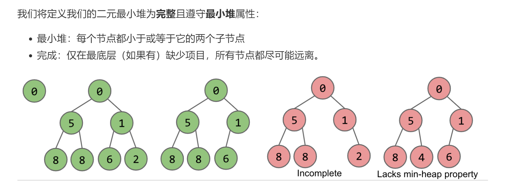
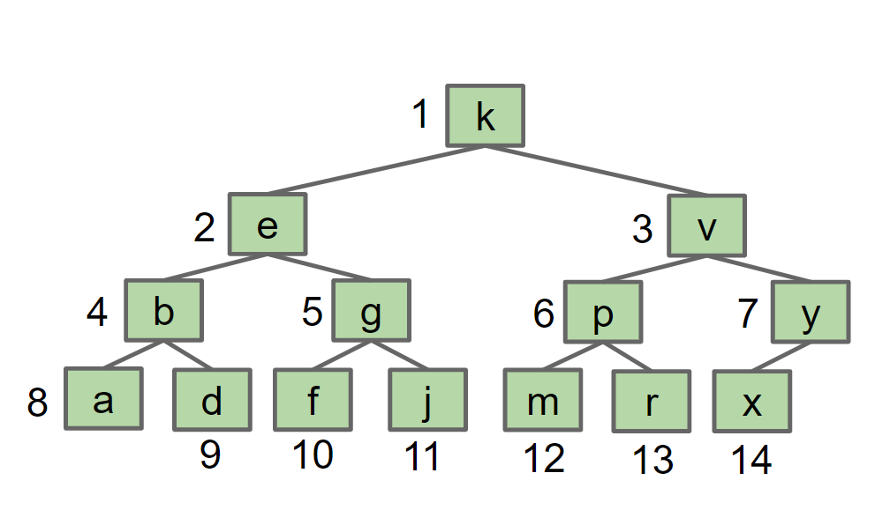
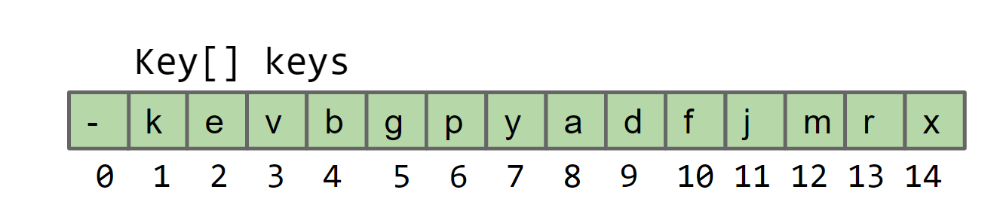
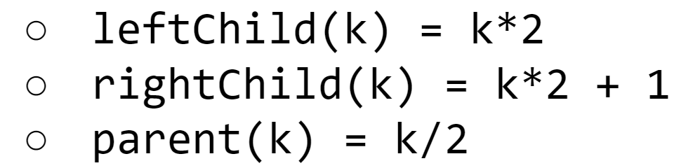

# 优先队列

> priority queue :优先队列能保证最快的

```java
/** (Min) Priority Queue: Allowing tracking and removal of 
  * the smallest item in a priority queue. */
public interface MinPQ<Item> {
    /** Adds the item to the priority queue. */
    public void add(Item x);
    /** Returns the smallest item in the priority queue. */
    public Item getSmallest();
    /** Removes the smallest item from the priority queue. */
    public Item removeSmallest();
    /** Returns the size of the priority queue. */
    public int size();
}
```

这是优先队列的接口

| method         | hash Table | LLRB tree   | sorted array | sorted ArrayList |
| -------------- | ---------- | ----------- | ------------ | ---------------- |
| add            | theta(1)   | theta(logn) | theta(n)     | theta(n)         |
| getSmallest    | theta(n)   | theta(logn) | theta(1)     | theta(1)         |
| removeSmallest | theta(n)   | theta(logn) | theta(n)     | theta(1)         |
| size           |            |             |              |                  |

最优实现：堆 heap 

> 堆是树的一种

堆属性：



第二个属性是完整性，也就是中间不能有洞.堆的属性决定了堆是自上而下堆积的，只允许叶子缺少，二元堆只有两个子节点

堆实现PQ的操作：（以最小堆为例，最上面元素最小叫最小堆）

add :

1. 直接在堆的最后加节点，如果节点值小于父节点则交换位置，依次类推

getSmallest:

1. 直接返回根节点

removeSmallest：

1. 把堆尾元素放到根节点，逻辑删除了根节点。如果该元素大于左右节点就交换位置。

显然 add 和removeSmallest是theta(logn) , getSmallest是常量级别。

#### 具体实现

以最大堆为例， 



堆长这样，也等价于



数组的第0号位置空出来方便计算。
观察可以发现 



上面的k是指数组的索引，这样能方便的找到一个节点的父节点和子节点进而实现相应的操作。