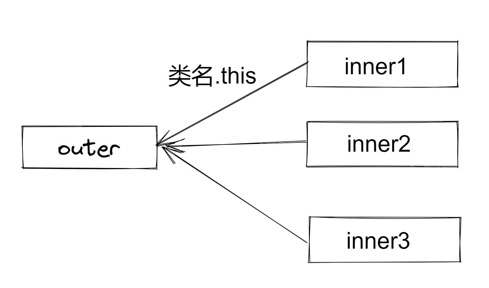

# 内部类

[toc]

## 普通内部类

### 内部类的定义

当一个类的定义中，包含了另外一个类的定义，那么前者称之为外部类，后者称之为内部类.

定义方式如下：

```java
public class Outer
{
    public class Inner
    {
        
    }
}
```

Outer就是外部类，Inner就是内部类

### 内部类的访问权限

外部类只有public 和 默认的包访问权限，内部类的访问权限同属性一样，有public 、protected、默认的包访问权限、private

```java
package md;

public class Outer
{
    public class Inner1
    {
        
    }
    class Inner2
    {

    }
    protected class Inner3
    {

    }
    private class Inner4
    {

    }
}

```

它们和类的成员访问权限相同

| 内部类权限 | 访问                                   |
| ---------- | -------------------------------------- |
| public     | 均可访问内部类                         |
| protected  | 外部类子类和同包可以访问内部类         |
|            | 同一个包可以访问内部类                 |
| private    | 外部类中均可访问内部类，其他地方均不可 |

一个小问题（建议跳过不看，这个太细了）：

对于protected的内部类，如果Outer2继承了Outer1,并且Outer2与Outer1不在同一个包中，那么Outer2中不可以new Inner的对象，因为protected的内部类的构造函数默认是与访问权限一致的，因此它的构造函数是protected的，也就只有同一个包或者内部类子类才能调用。在另外一个包中的继承外部类的类，也就是Outer2不能够new Inner的对象，除非**显式的给Inner写一个public 的构造函数。**

### 内部类与外部类之间的链接

> 1. 内部类可以访问外部类的任何成员

> 2. 外部类也可以访问内部类的任何成员

##### 对于第一个性质

每个内部类都会有一个指向外部类的引用，通过这个引用可以访问外部类的所有成员。

```java
package md;

import edu.princeton.cs.algs4.StdOut;

public class Outer
{
    public int i0 = 0;
    protected  int i1 = 1;
    int i2 = 2;
    private int i3 = 3;
    public class Inner1
    {
        int sum = i0 + i1 + i2 + i3;
    }
     class Inner2
    {
        int sum = i0 + i1 + i2 + i3;
    }
    protected class Inner3
    {
        int sum = i0 + i1 + i2 + i3;
    }
    private class Inner4
    {
        int sum = i0 + i1 + i2 + i3;
    }
}
```

注意，在不同内部类中的同名变量不会冲突，因为不同内部类之间不能相互访问。而对于外部类而言，它将通过内部类的实例来访问内部类对象的属性。（后面加深理解，这里简单谈一下）

可以看到，内部类对外部类的访问非常简单，之间使用外部类的成员即可。

实际上，内部类对外部类的变量的访问省略了 Outer.this. ， 也就是说：    **外部类类名.this**  是一个指向外部类对象的引用。

 因为每一个内部类对象都会只与一个外部类对象绑定（一个外部类对象却能和多个内部类对象绑定），所以既然这个引用都是一样的，自然可以省略，就像对this指针的使用一样。当然，也可以用它来区分内部类和外部类的同名属性。

```java
        int sum = Outer.this.i0 + Outer.this.i1 + Outer.this.i2 + Outer.this.i3;
```

另外值得注意的是：要new内部类对象之前，必须要有外部类对象，保证Outer.this指针是不为空的。也可以把外部类对象看成是内部类对象的一部分，有点类似继承。

##### 对于第二个性质

粗俗解释：如果类Inner是类Outer的成员，那么类Inner的成员自然也是Outer的成员

值得注意的是，外部类要访问内部类之前，需要先持有一个内部类对象的引用，像下面这样

```java
public class Outer
{
    public class Inner
    {
        public int i0 = 0;
        protected  int i1 = 1;
        int i2 = 2;
        private int i3 = 3;
    }
    public void print(Inner inner)
    {
        int sum = inner.i0 + inner.i1 + inner.i2 + inner.i3;
        System.out.println(sum);
    }
}
```

因为内部类只是定义了这个类的存在，但并没有实例化任何内部类的成员。

要new内部类对象之前，必须要先有外部类对象。

但是new外部类对象之前，并不需要内部类对象的存在。

这个观点将在后面继续深化。

### 如何创造内部类对象

##### 使用.new 创造内部类对象

语法

```java
外部类名.内部类名 对象名 = 外部类对象名.new 内部类名();
```

示例:

```java
public class Test
{
    public static void main(String[] args)
    {
        Outer outer = new Outer();
        Outer.Inner inner = outer.new Inner();
    }
}
```

理解： 可以把**外部类名.内部类名**当成是内部类的真正类名，因为要new内部类对象之前，必须要先有外部类对象，所以这里通过 对象名.new来实现将内部类对象和一个外部类对象绑定的过程。

同时也可以看到，外部类的创建与内部类之间并没有关系。这种设计合乎情理。

> 注意，创造内部类对象遵循内部类的访问权限，只有在能访问内部类的地方才能创建内部类对象

> 内部类中使用类名.this 获取外部类对象，通过外部类对象名.new来创建内部类对象

##### 内部类对象访问内部类属性

一句话： 和一般的类访问权限控制符一样的。

```java
public class Outer
{
    public class Inner
    {
        public int i0 = 0;
        protected  int i1 = 1;
        int i2 = 2;
        private int i3 = 3;
    }
    public void print(Inner inner)
    {
        int sum = inner.i0 + inner.i1 + inner.i2 + inner.i3;
        System.out.println(sum);
    }
}

// 在同一个包下的另外文件中的类
package md;

public class Test
{
    public static void main(String[] args)
    {
        Outer outer = new Outer();
        Outer.Inner inner = outer.new Inner();
        // 下面这一行将报错，因为内部类的定义中i3是private的
        int sum = inner.i0 + inner.i1 + inner.i2 + inner.i3;
    }
}
```

##### 创建多个外部类对象

```java
public class Test
{
    public static void main(String[] args)
    {
        Outer outer = new Outer();
        Outer.Inner inner1 = outer.new Inner();
        Outer.Inner inner2 = outer.new Inner();
        Outer.Inner inner3 = outer.new Inner();
    }
}
```



## 局部内部类

局部内部类指的是定义在方法体中或者作用域（两个大括号）中的内部类。其特性与普通的内部类一模一样。

但是特点在于:

1. 局部内部类只能在它的作用域中才能被访问到。

2. 局部内部类没用访问权限控制符，只有默认的
3. 局部内部类也只加载编译一次，就像普通类一样，不会有额外的开销

下面的代码说明了：局部内部类可以和普通内部类一样访问外部类的所有属性，并且外部类也可以在作用域范围内访问局部内部类的所有属性。

```java
public class Outer
{

    public int j0 = 0;
    protected  int j1 = 1;
    int j2 = 2;
    private int j3 = 3;
    public void print()
    {
        class Inner
        {
            public int i0 = 0;
            protected  int i1 = 1;
            int i2 = 2;
            private int i3 = 3;
            private int sum = j0 + j1 + j2 + j3;
        }
        Inner inner = new Inner();
        int sum = inner.i0 + inner.i1 + inner.i2 + inner.i3;
        System.out.println(sum);
    }
}
```


## 内部类的典型用法

在介绍接下来的知识之前，先通过初步认识一下内部类的典型用法

1. 首先写一个接口

```java
public interface Name
{
    void printName();
}

```

2. 如果我们想要实现这个接口，通常情况下，我们需要实现这个接口，但这在设计上并不总是行的通，但是有了内部类以后，我们可以如下做法
    1. 定义一个私有内部类实现接口，因为是一个私有内部类，就决定了几乎外界完全无法接触到这个私有内部类。
    2. 定义一个public 方法，返回一个接口类型的引用，这里会发生隐含的类型转换

```java
public class People
{
    private class ChineseName implements Name
    {
        @Override
        public void printName()
        {
            System.out.println("中国");
        }
    }
    public Name name()
    {
        return new ChineseName();
    }
}
```

3. 如果要扩展这个类，我们只需要再写一个内部类即可

```java
public class People
{
    private boolean choice = true;
    private class EnglishName implements Name
    {
        @Override
        public void printName()
        {
            System.out.println("English");
        }
    }
    private class ChineseName implements Name
    {
        @Override
        public void printName()
        {
            System.out.println("中国");
        }
    }
    public Name name()
    {
        if (choice)
        {
            return new ChineseName();
        }
        else
        {
            return new EnglishName();
        }
    }
}
```

4. 但是这样代码看上去依然还是有点不易于扩展，这个时候可以使用工厂设计模式方法来继续改正

再创建一个接口专门用来创建名字对象

```java
package md;

public interface NameFactory
{
    Name makeName();
}
```

然后为每种名字都增加一个名字工厂的实现类

```java
package md;

public class People
{
    private class EnglishName implements Name
    {
        @Override
        public void printName()
        {
            System.out.println("English");
        }
    }
    private class ChineseName implements Name
    {
        @Override
        public void printName()
        {
            System.out.println("中国");
        }
    }
    public class ChineseNameFactory implements NameFactory
    {
        @Override
        public Name makeName()
        {
            return new ChineseName();
        }
    }
    public class EnglishNameFactory implements NameFactory
    {
        @Override
        public Name makeName()
        {
            return new EnglishName();
        }
    }
    public Name name(NameFactory nameFactory)
    {
        return nameFactory.makeName();
    }
}
```

4. 如果还要继续扩展这个类，ok, 可以完全不用改动早先的代码，只需要增加一个Name类和相应的NameFactory类即可。

上面这些都是在一个类中完成这些工作。

但往往我们有其他的需要，比如ChineseName 和 EnglishName 不仅可以是人的专属，很多动物也是有名字的，在这种情况下，用私有内部类就已经不太合适了，我们将它们重新组织，用多个类来表示，于是上面的代码可以继续重构。

在继续重构之前，需要学习匿名内部类。


## 匿名内部类

> 什么是匿名内部类？

简单来说，匿名内部类可以看成是一个没有名字的内部类，它具有内部类所具有的所有特性，但是，光从匿名内部类这个名字也看得出来，匿名内部类并没有具体的姓名，这也决定了匿名内部类几乎总只可以创建一个对象。

典型的匿名内部类被用于new 接口或者 new 抽象类，当然它们也可以用于普通类的创建

##### 匿名内部类的定义

语法格式 :  就是在new对象的后面加上了一对中括号

```java
new 类名/接口名(){
    // 实现接口或抽象类的代码，或者重写普通类的代码
}
```

举例来说：

对于一个接口

```java
package md;

public interface Name
{
    void printName();
}

```

可以这样创建接口对象

```java
package md;

public class Student
{
    Name name = new Name()
    {
        @Override
        public void printName()
        {
            System.out.println("student");      
        }
    };
}
```

这种做法等效于下面的方式

```java
package md;

public class Student
{
    private class MyName implements Name
    {
        @Override
        public void printName()
        {
            System.out.println("student");
        }
    }
    Name name = new MyName();
}
```

上面那种奇怪的语法就相当于在说：

我声明了一个没有名字的类，它实现了Name接口，然后在中括号中写出实现代码。最后通过new 运算符返回这个对象的一个实例。（如果对应的是普通类，意义相当于它继承了这个普通类，并且可以在中括号中对父类的方法进行重写等操作）

几乎可以肯定的是，这个匿名内部类几乎在其他任何地方都无法再被访问了。所以非常适合只使用一次的类。

当然，它可以访问外部类的成员，就像这样

```java
public class Student
{
    private int id = 0;
    Name name = new Name() {
        @Override
        public void printName()
        {
            System.out.println("student" + id);
        }
    };
}
```

##### 匿名内部类的应用

使用匿名内部类可以扩展上面的例子

中文名

```java
package md;

public class ChineseName implements Name
{
    private ChineseName(){}
    @Override
    public void printName()
    {
        System.out.println("中国");
    }

    static NameFactory factory = new NameFactory()
    {
        @Override
        public Name makeName()
        {
            return new ChineseName();
        }
    };
}

```

英文名

```java
package md;

public class EnglishName implements Name
{
    private EnglishName(){}
    @Override
    public void printName()
    {
        System.out.println("English");
    }

    static NameFactory factory = new NameFactory()
    {
        @Override
        public Name makeName()
        {
            return new EnglishName();
        }
    };
}

```

任务代码：

```java
package md;

public class Item1
{
    public static void printName(NameFactory factory)
    {
        Name name = factory.makeName();
        name.printName();
    }
    public static void main(String[] args)
    {
        printName(ChineseName.factory);
        printName(EnglishName.factory);
    }
}
```

现在如果要进行扩展，只需要再创建新的类即可，如果要扩展现有的类，只需要在现有的类中加入新的内部类即可，这增大了扩展型但会带来更大的复杂性。


##### 对于匿名内部类的几点注意

1. 匿名内部类中使用的外部的对象都必须在匿名内部类中声明为final 或者表达为final 的意思，也就是不能在匿名内部类中 更改外部对象
2. 匿名内部类只能最多实现一个接口，或者继承一个类
3. 匿名内部类的构造函数因为没有名字，所以需要通过实例代码块的方式完成类似的构造函数的功能，通过在new 类名（）{}中的类名后面的小括号中传参也可以调用父类的有参构造函数
4. 匿名内部类需要的参数可以通过方法参数等形式传递，因为匿名内部类可以访问外部的所有成员，也包括它所在方法的参数

5. **匿名内部类实例化对象不需要得到外部类对象的引用**


### 嵌套类

> 即静态的内部类

1. 嵌套类对象的创建不需要外部类的应用
2. 嵌套类只可以访问外部的静态成员
3. 其他语法格式和内部类差不多

```java
package md;

public class OuterStatic
{
    public  static class Inner
    {

    }
}
class Test03
{
    public static void main(String[] args)
    {
        OuterStatic.Inner inner = new OuterStatic.Inner();
    }
}
```


