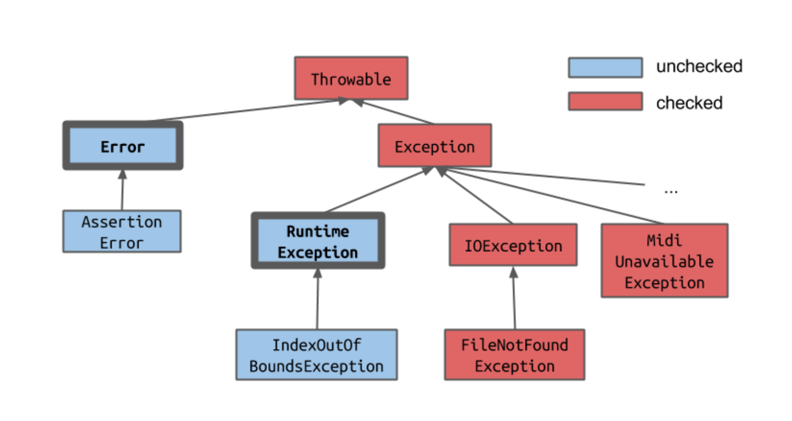

# 异常

####  try - catch 块，用来抓住异常

```java
try
{
    int a = 3/0;
} catch(Exception e)
{
    System.out.println("0 can't be divided");
}

try
{
    throw Exception e
} catch(Exception e)
{
    System.out.println("something erroe");
}

```

#### 必须捕获的异常



对于必须捕获的异常，程序员必须要写catch块，因为这些异常能够捕获，能够预测，编译器需要程序员尽最大能力捕获并处理

```java
public void add (int a, int b) throws IOException
{
    
}
// 声明以后就可以捕获异常，但使用者必须捕获异常
```

