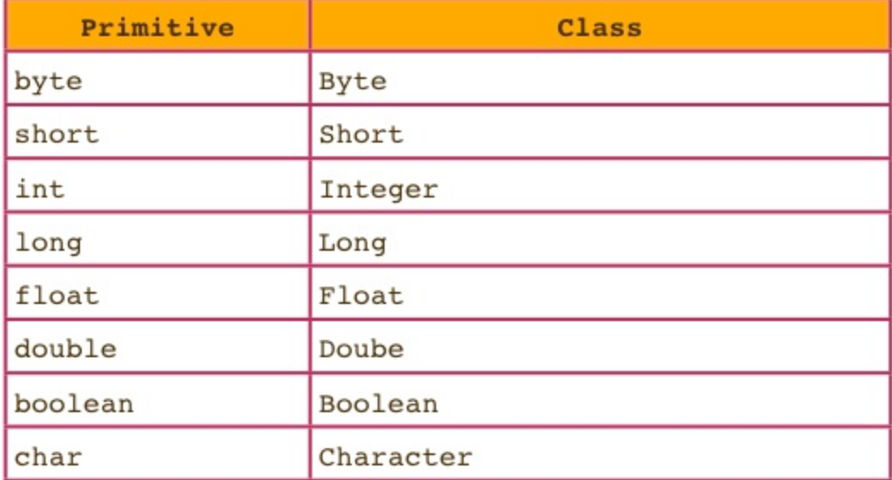

# Automatic Conversions

> 介绍一些常用的自动类型转换

## Autoboxing and Unboxing

> 自动拆箱与装箱，箱是啥呢？箱是对8种基本类型的包装类 wrapper



```java
public void int add(Object a, Object b);
public void int add2(int a, int b);
public static void main(String[] args)
{
    // autoboxing 
	add(1,3);   // '1' will become new Integer(1),
    // unboxing 
    add2(new Integer(2), new Integer(3)); // new Interger(2) will become 2;
    
    add2((new Integer(2)).valueOf(), new Integer(3).valueOf()); // also can get value
}
```


####  pay attention:

在进行自动装箱和拆箱时，需要牢记以下几点：

- 数组永远不会自动装箱或自动拆箱，例如，如果您有一个整数数组`int[] x`，并尝试将其地址放入 type 变量中`Integer[]`，编译器将不允许您的程序编译。
- 自动装箱和拆箱也会对性能产生可衡量的影响。也就是说，依赖于自动装箱和拆箱的代码将比避免这种自动转换的代码慢。
- 此外，包装类型比原始类型使用更多的内存。在大多数现代计算机上，您的代码不仅必须持有对对象的 64 位引用，而且每个对象还需要 64 位开销用于存储对象的动态类型等内容。

## widening 

> 加宽：精度小的可以自动转换为大的，精度大的必须通过cast来强制转换

```java
double a = 10.4;
int b = 4;
a = b; // ok , a will become 4;
b = a; // error , can't compile
a = 10.4;
b = (int) a;// ok ,now b = 10;
```


