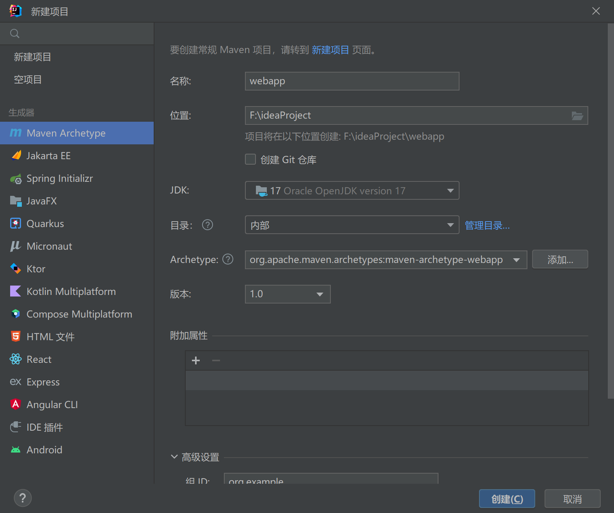
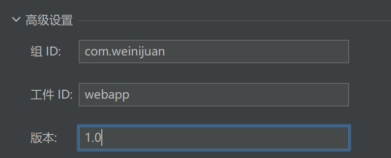
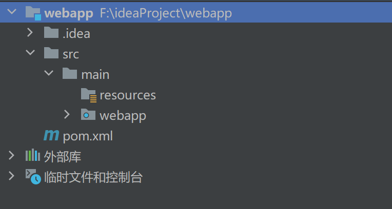
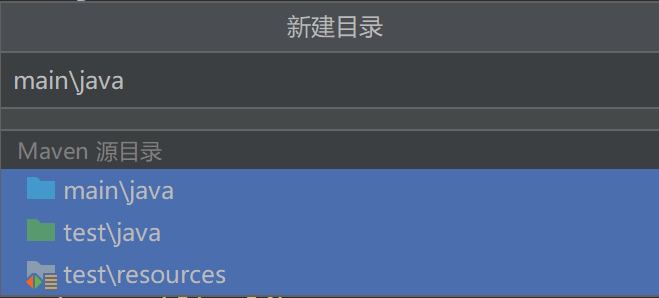
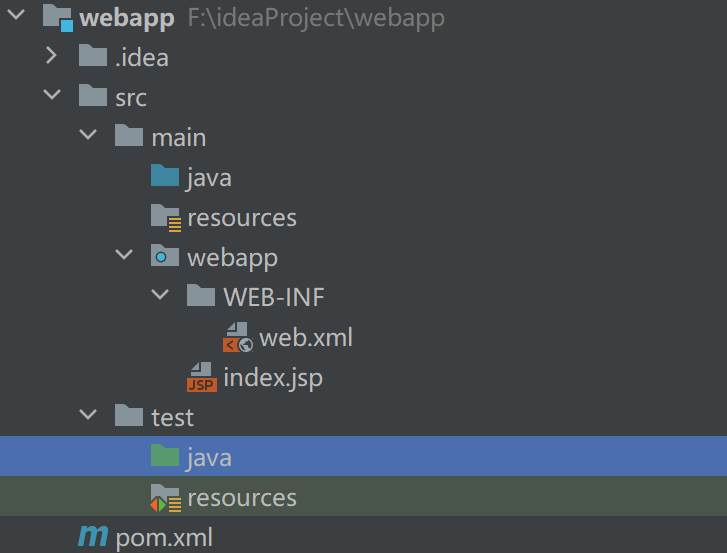
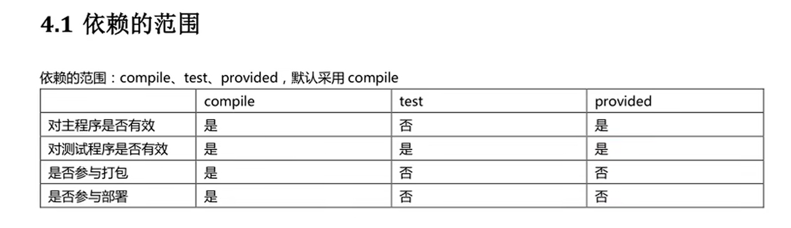

# maven

### 在idea中新建maven工程

主要位置是Archetype要选择图中的



下面的高级设置自己定义即可



然后如下所示目录结构，因为我们的maven用了镜像，所以控制台奇怪一点



新建一些目录，在src中alt+insert就会自动出现这些目录



结果



其他可选配置

```xml
  <!-- 指定jdk与字符集-->
 <properties>
    <project.build.sourceEncoding>UTF-8</project.build.sourceEncoding>
    <maven.compiler.encoding>UTF-8</maven.compiler.encoding>
    <java.version>17</java.version>
    <maven.compiler.source>17</maven.compiler.source>
    <maven.compiler.target>17</maven.compiler.target>
  </properties>
 <!--指定war包打包插件-->
  <build>
    <finalName>dept</finalName>
    <plugins>
      <plugin>
        <groupId>org.apache.maven.plugins</groupId>
        <artifactId>maven-war-plugin</artifactId>
        <version>3.3.1</version>
      </plugin>
    </plugins>
  </build>
```

在main中的java目录下写源代码(servlet等)即可。

再点击右上角编辑配置，添加本地Tomcat,部署工件

```
war模式：将WEB工程以包的形式上传到服务器 ；
war exploded模式：将WEB工程以当前文件夹的位置关系上传到服务器；通常开发选择这种，便于更改
```

更改应用程序上下文（application/ servletContext）为项目根路径即可。

### 依赖范围



compile最强，test只在测试中用到，provided表示被提供，打包时无需带但编译需要