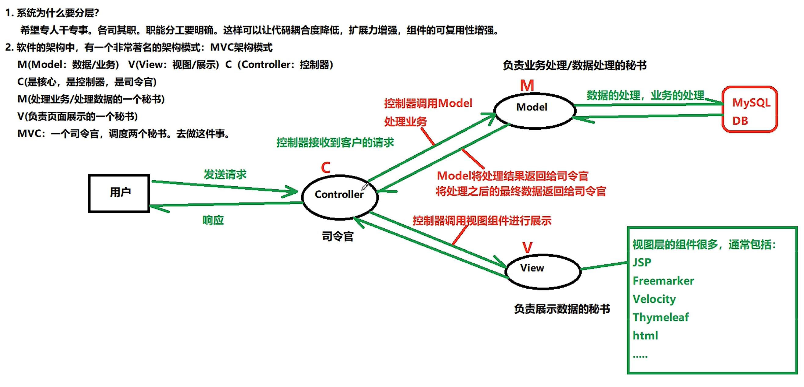
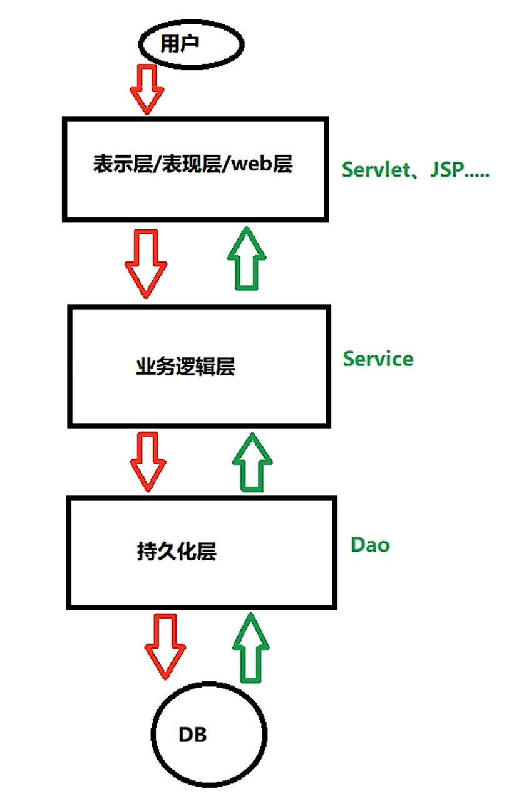
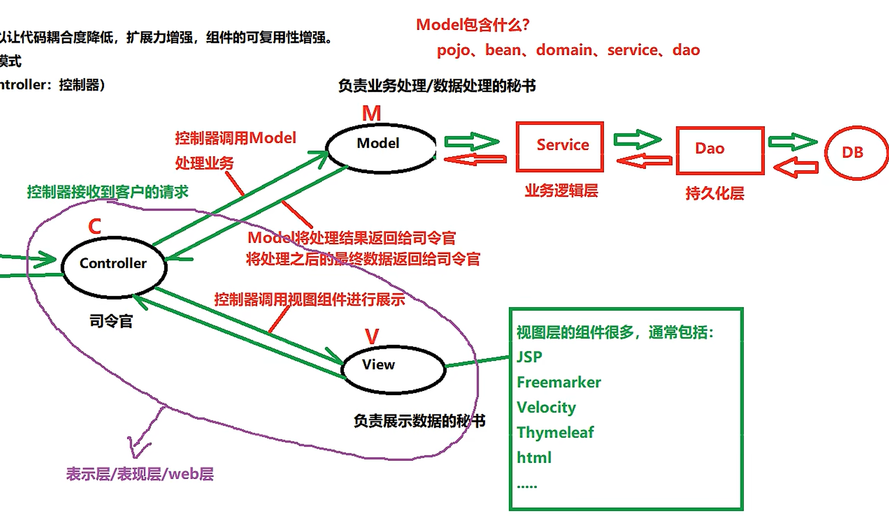
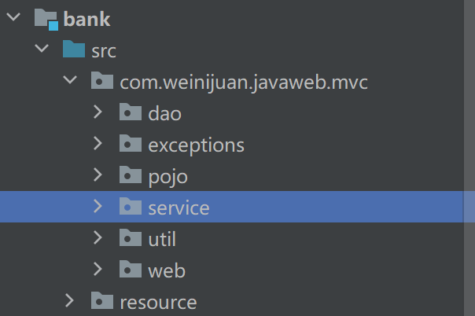
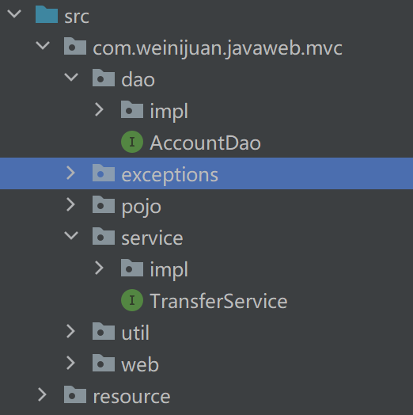
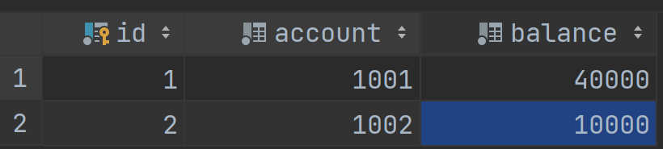
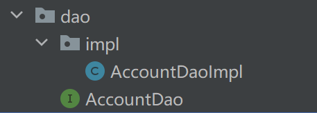
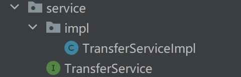

# Spring-mvc

#### MVC架构模式



#### 三层架构



#### 三层架构与MVC架构之间的关系



#### DAO

1. Data Access object : 数据访问对象
2. DAO是javaEE的设计模式之一
3. DAO只负责数据库的增删改查，不应有任何的业务逻辑
4. 通常一张表对应一个DAO对象，以表名加Dao来命名如 t_student表对应 studentDao对象
5. 通常方法名是固定的，比如 insert、

#### Service

1. 负责处理业务
2. 起名通常为 XXXService
3. 方法名通常要体现出相应的业务

#### 银行转账MVC模式案例

##### 目录结构




其中 exceptions放置自定义异常、util放置数据库处理工具、pojo放置朴素java数据对象（bean）（负责对象化数据库中的每一条数据）

dao 放置数据库处理对象,即可持久化层
service 放置要处理的业务代码，即业务逻辑层
web 放置servlet，相当于 controller



为了解耦合，dao和service下各自有一个包放置实现类，外部放置接口


##### 数据库



##### resource包

放置 dbConfig.properties文件

```java
url=jdbc:mysql://localhost:3306/whu
user=root
password=hwj11133334
clazzName=com.mysql.cj.jdbc.Driver
```


##### util

为了便利工具类中不应该在方法签名中加异常

ThreadLocal 相当于一个Map集合，key是线程，value是泛型，且增删改时key始终是Thread.CurrentThread()

```java
package com.weinijuan.javaweb.mvc.util;

import java.sql.*;
import java.util.ResourceBundle;

public class DBUtil
{
    private DBUtil(){}
// 获取配置信息
    private static ResourceBundle bundle = ResourceBundle.getBundle("resource.dbConfig");
    private static String url = bundle.getString("url");
    private static String user = bundle.getString("user");
    private static String password = bundle.getString("password");
    private static String clazz = bundle.getString("clazzName");
// 获取 ThreadLocal, 一个线程对应一个Connection连接对象，处理后续的事务
    private static ThreadLocal<Connection> connectionThreadLocal = new ThreadLocal<>();
// 注册驱动
    static {
        try
        {
            Class.forName(clazz);
        } catch (ClassNotFoundException e)
        {
            throw new RuntimeException(e);
        }
    }
// 获取连接对象
    public static Connection getConnection()
    {
        Connection connection = null;
        try
        {
            if (connectionThreadLocal.get() == null)
            {
                connection = DriverManager.getConnection(url, user, password);
                connectionThreadLocal.set(connection);
            }
            else
            {
                connection = connectionThreadLocal.get();
            }
        } catch (SQLException e)
        {
            throw new RuntimeException(e);
        }
        return connection;
    }
// 资源关闭
    public static void close(Connection conn, Statement statement, ResultSet resultSet)
    {
        if (resultSet != null)
        {
            try
            {
                resultSet.close();
            } catch (SQLException e)
            {
                throw new RuntimeException(e);
            }
        }
        if (statement != null)
        {
            try
            {
                statement.close();
            } catch (SQLException e)
            {
                throw new RuntimeException(e);
            }
        }
        if (conn != null)
        {
            try
            {
                connectionThreadLocal.remove();
                conn.close();
            } catch (SQLException e)
            {
                throw new RuntimeException(e);
            }
        }
    }
}

```

##### pojo

用java对象表示数据库中的记录，idea自动生成

```java
package com.weinijuan.javaweb.mvc.pojo;

import java.util.Objects;

public class User
{
    private double balance;
    private long account;

    @Override
    public String toString()
    {
        return "User{" +
                "balance=" + balance +
                ", account=" + account +
                '}';
    }

    @Override
    public boolean equals(Object o)
    {
        if (this == o) return true;
        if (o == null || getClass() != o.getClass()) return false;
        User user = (User) o;
        return Double.compare(user.balance, balance) == 0 && account == user.account;
    }

    @Override
    public int hashCode()
    {
        return Objects.hash(balance, account);
    }

    public double getBalance()
    {

        return balance;
    }

    public void setBalance(double balance)
    {
        this.balance = balance;
    }

    public long getAccount()
    {
        return account;
    }

    public void setAccount(long account)
    {
        this.account = account;
    }

    public User()
    {

    }

    public User(double balance, long account)
    {
        this.balance = balance;
        this.account = account;
    }
}

```

##### dao




接口

```java
public interface AccountDao
{
    int insert(User user);

    int delete(long account);

    int update(User user);

    User select(long account);

    List<User> selectAll();
}
```


实现类，只以insert为例

```java
public class AccountDaoImpl implements AccountDao
{
    @Override
    public int insert(User user)
    {
        Connection conn = DBUtil.getConnection();
        String sql = "insert into bank(account, balance) values(?, ?)";
        PreparedStatement statement = null;
        ResultSet rs = null;
        int count = 0;
        try
        {
             statement = conn.prepareStatement(sql);
            statement.setString(1, String.valueOf(user.getAccount()));
            statement.setString(2, String.valueOf(user.getBalance()));
             count = statement.executeUpdate();
        } catch (SQLException e)
        {
            throw new RuntimeException(e);
        } finally
        {
            // 这里不能关闭connection对象，一个线程一个connection，因此connection智能在事务中关闭
            DBUtil.close(null,statement, rs );
        }
        return count;
    }
}
```

#### service

service用来处理相应的功能，并与dao对象进行交互，从而实现对数据库的操纵



```java
public class TransferServiceImpl implements TransferService
{
    // 此时可以将dao视作一张表
    private static final AccountDao dao = new AccountDaoImpl();
    @Override
    public void transfer(long postAccount, long receiverAccount, double money) throws BalanceNotEnoughException, AppException
    {
        // 一个服务对应一个事务，通过connection与ThreadLocal的关系，使当前线程使用的都是同一个connection对象，从而达到事务的功能
        try (Connection connection = DBUtil.getConnection())
        {
            User poster = dao.select(postAccount);
            User receiver = dao.select(receiverAccount);
            if (poster.getBalance() < money)
            {
                throw new BalanceNotEnoughException("余额不足");
            }
            poster.setBalance(poster.getBalance() - money);
            receiver.setBalance(receiver.getBalance() + money);
            connection.setAutoCommit(false);
            int count = dao.update(poster);
//            String s = null;
//            s.toLowerCase();
            count += dao.update(receiver);
            if (count != 2)
            {
                throw new AppException("软件异常");
            }
            connection.commit();
            // 在这里关闭connection对象
            DBUtil.close(connection, null, null);
        } catch (SQLException e)
        {
            throw new RuntimeException(e);
        }
    }
}
```

##### web

放置servlet, 尽量只进行控制，比如接受请求数据和发送响应等

```java
package com.weinijuan.javaweb.mvc.web;

import com.weinijuan.javaweb.mvc.exceptions.AppException;
import com.weinijuan.javaweb.mvc.exceptions.BalanceNotEnoughException;
import com.weinijuan.javaweb.mvc.service.TransferService;
import com.weinijuan.javaweb.mvc.service.impl.TransferServiceImpl;
import com.weinijuan.javaweb.mvc.util.DBUtil;
import jakarta.servlet.ServletException;
import jakarta.servlet.annotation.WebServlet;
import jakarta.servlet.http.HttpServlet;
import jakarta.servlet.http.HttpServletRequest;
import jakarta.servlet.http.HttpServletResponse;

import java.io.IOException;
import java.sql.Connection;
import java.sql.SQLException;

@WebServlet("/transfer")
public class AccountServlet extends HttpServlet
{
    @Override
    protected void doPost(HttpServletRequest request, HttpServletResponse response) throws ServletException
            , IOException
    {
        String postAccount = request.getParameter("post");
        String receiveAccount = request.getParameter("receive");
        String money = request.getParameter("money");
        TransferService service = new TransferServiceImpl();
        try 
        {
            service.transfer(Long.parseLong(postAccount), Long.parseLong(receiveAccount),
                    Double.parseDouble(money));
            response.sendRedirect(request.getContextPath() + "/success.jsp");
        }catch (BalanceNotEnoughException e)
        {
            response.sendRedirect(request.getContextPath()+"/balanceError.jsp");
        } catch (Exception e)
        {
            response.sendRedirect(request.getContextPath()+"/appError.jsp");
        }
    }
}

```

##### exceptions

放置自定义异常对象

```java
package com.weinijuan.javaweb.mvc.exceptions;

public class BalanceNotEnoughException extends Exception
{
    public BalanceNotEnoughException()
    {
        super();
    }
    public BalanceNotEnoughException(String message)
    {
        super(message);
    }
}

```


##### view 

主要放置一些jsp等前端页面


